# Development Workflow

<cite>
**Referenced Files in This Document**
- [pnpm-workspace.yaml](file://pnpm-workspace.yaml)
- [package.json](file://package.json)
- [README.md](file://README.md)
- [AGENT.md](file://AGENT.md)
- [ARCHITECTURE.md](file://ARCHITECTURE.md)
- [TESTING.md](file://TESTING.md)
- [tsconfig.json](file://tsconfig.json)
- [vitest.config.ts](file://vitest.config.ts)
- [biome.jsonc](file://biome.jsonc)
- [.stylelintrc.json](file://.stylelintrc.json)
- [vscode/package.json](file://vscode/package.json)
- [agent/package.json](file://agent/package.json)
- [vscode/CONTRIBUTING.md](file://vscode/CONTRIBUTING.md)
- [jetbrains/CONTRIBUTING.md](file://jetbrains/CONTRIBUTING.md)
</cite>

## Table of Contents
1. [Introduction](#introduction)
2. [Project Structure](#project-structure)
3. [Core Components](#core-components)
4. [Architecture Overview](#architecture-overview)
5. [Detailed Component Analysis](#detailed-component-analysis)
6. [Dependency Analysis](#dependency-analysis)
7. [Performance Considerations](#performance-considerations)
8. [Troubleshooting Guide](#troubleshooting-guide)
9. [Contribution Guidelines](#contribution-guidelines)
10. [Continuous Integration and Release Management](#continuous-integration-and-release-management)
11. [Conclusion](#conclusion)

## Introduction
This document describes Cody’s development workflow and tooling across a monorepo powered by pnpm workspaces. It covers package management, dependency resolution, build orchestration, development environments for VS Code and JetBrains, the build system (TypeScript compilation, asset bundling, platform-specific builds), debugging techniques, development server and hot reloading, testing and CI practices, and contribution workflows.

## Project Structure
Cody is organized as a pnpm workspace with multiple packages:
- Root workspace configuration defines packages for agent, cli, lib/*, vscode, and web.
- The root package orchestrates scripts for building, testing, formatting, and release tasks.
- Each package (agent, vscode, web) has its own build and test configuration.

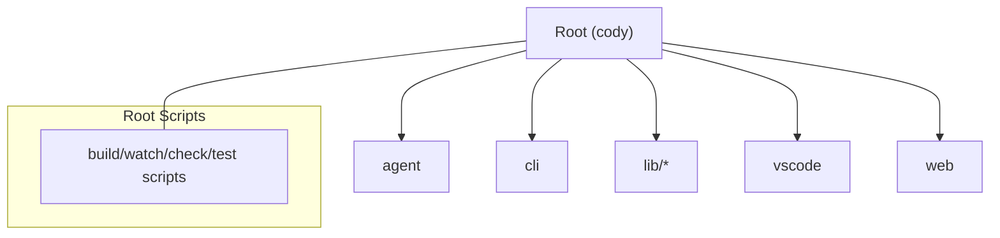

**Diagram sources**
- [pnpm-workspace.yaml:1-8](file://pnpm-workspace.yaml#L1-L8)
- [package.json:18-39](file://package.json#L18-L39)

**Section sources**
- [pnpm-workspace.yaml:1-8](file://pnpm-workspace.yaml#L1-L8)
- [package.json:1-99](file://package.json#L1-L99)

## Core Components
- Monorepo tooling: pnpm workspaces and root scripts coordinate builds and tests across packages.
- TypeScript configuration enables composite builds and references across packages.
- Vitest config centralizes global setup for tests.
- Formatting and linting via Biome and Stylelint.
- Package-specific build scripts for desktop and web targets.

Key responsibilities:
- Root package: orchestration, formatting, linting, and cross-package scripts.
- agent: CLI and agent runtime with platform-specific bundling.
- vscode: VS Code extension host and webviews, esbuild and vite builds.
- web: Web UI assets and build pipeline.

**Section sources**
- [package.json:18-39](file://package.json#L18-L39)
- [tsconfig.json:27-35](file://tsconfig.json#L27-L35)
- [vitest.config.ts:1-8](file://vitest.config.ts#L1-L8)
- [biome.jsonc:1-149](file://biome.jsonc#L1-L149)
- [.stylelintrc.json:1-28](file://.stylelintrc.json#L1-L28)
- [agent/package.json:13-26](file://agent/package.json#L13-L26)
- [vscode/package.json:11-56](file://vscode/package.json#L11-L56)

## Architecture Overview
The development architecture integrates:
- Composite TypeScript builds across packages.
- esbuild for Node and browser bundles in the VS Code extension.
- Vite for webviews and web UI assets.
- Agent runtime with JSON-RPC protocol and optional remote debugging.
- Cross-platform builds for Windows/macOS/Linux.

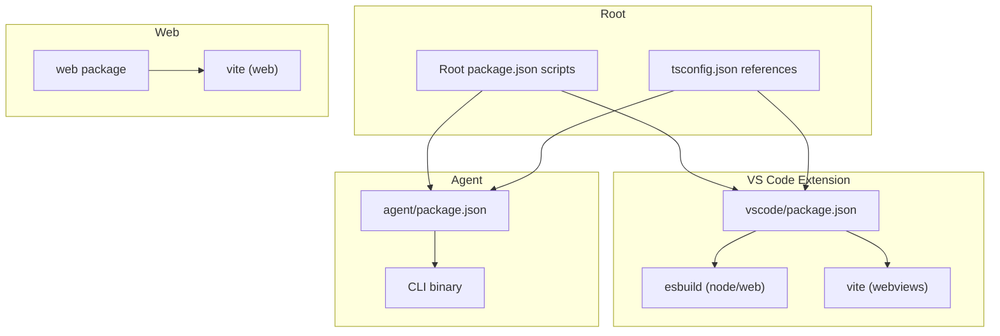

**Diagram sources**
- [package.json:18-39](file://package.json#L18-L39)
- [tsconfig.json:27-35](file://tsconfig.json#L27-L35)
- [vscode/package.json:34-37](file://vscode/package.json#L34-L37)
- [agent/package.json:15-18](file://agent/package.json#L15-L18)
- [vscode/package.json:11-56](file://vscode/package.json#L11-L56)

## Detailed Component Analysis

### Monorepo and Build Orchestration
- Workspace definition lists packages and glob patterns for tests.
- Root scripts delegate to sub-packages for build, test, and release tasks.
- Composite TypeScript builds enable incremental compilation across packages.

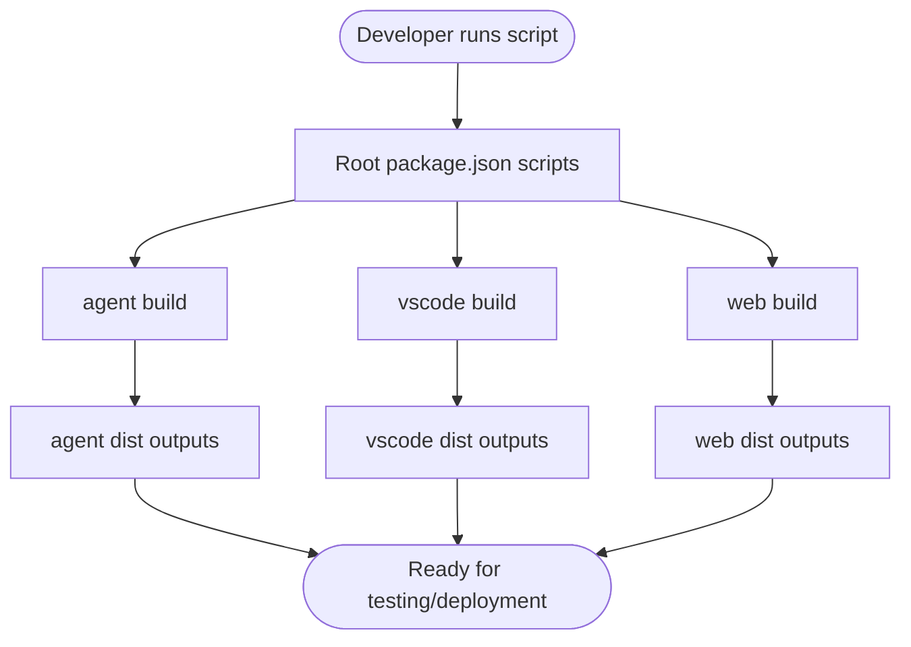

**Diagram sources**
- [pnpm-workspace.yaml:1-8](file://pnpm-workspace.yaml#L1-L8)
- [package.json:18-39](file://package.json#L18-L39)
- [agent/package.json:15-18](file://agent/package.json#L15-L18)
- [vscode/package.json:22-32](file://vscode/package.json#L22-L32)

**Section sources**
- [pnpm-workspace.yaml:1-8](file://pnpm-workspace.yaml#L1-L8)
- [package.json:18-39](file://package.json#L18-L39)
- [tsconfig.json:27-35](file://tsconfig.json#L27-L35)

### TypeScript Compilation and References
- Composite builds configured with references to agent, lib, vscode, and web packages.
- Watch options optimized for file system events.
- Strict compiler options and source maps enabled.

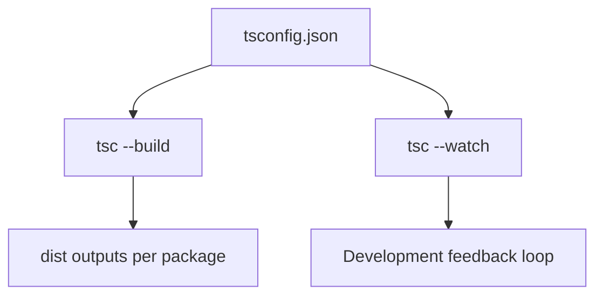

**Diagram sources**
- [tsconfig.json:1-37](file://tsconfig.json#L1-L37)

**Section sources**
- [tsconfig.json:1-37](file://tsconfig.json#L1-L37)

### Asset Bundling and Platform Builds
- VS Code extension uses esbuild for Node and browser bundles with aliases and external modules.
- Vite builds webviews and web UI assets.
- Agent builds a CLI binary and related assets.

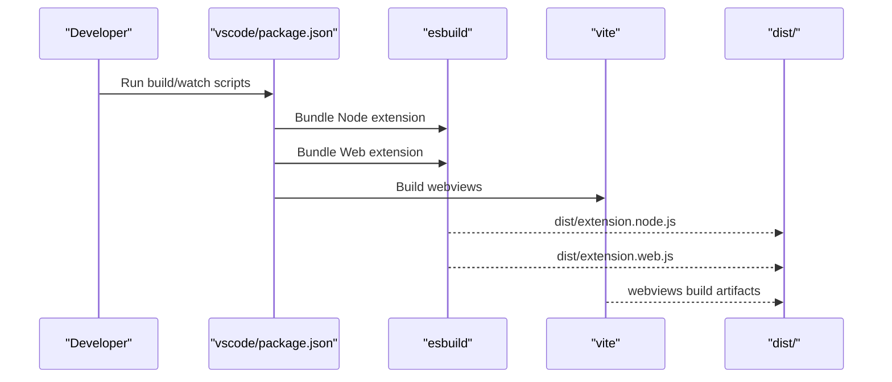

**Diagram sources**
- [vscode/package.json:34-37](file://vscode/package.json#L34-L37)
- [vscode/package.json:22-32](file://vscode/package.json#L22-L32)

**Section sources**
- [vscode/package.json:11-56](file://vscode/package.json#L11-L56)
- [agent/package.json:15-26](file://agent/package.json#L15-L26)

### Testing and Test Orchestration
- Vitest is configured centrally with a global setup file.
- Root scripts run unit, integration, and E2E tests across packages.
- VS Code extension provides Playwright-based E2E and integration tests.

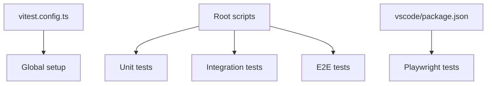

**Diagram sources**
- [vitest.config.ts:1-8](file://vitest.config.ts#L1-L8)
- [package.json:27-31](file://package.json#L27-L31)
- [vscode/package.json:44-51](file://vscode/package.json#L44-L51)

**Section sources**
- [vitest.config.ts:1-8](file://vitest.config.ts#L1-L8)
- [package.json:27-31](file://package.json#L27-L31)
- [vscode/package.json:44-51](file://vscode/package.json#L44-L51)
- [TESTING.md:1-317](file://TESTING.md#L1-L317)

### Formatting, Linting, and Style
- Biome enforces imports, style, correctness, and complexity rules; formatter settings match style guide.
- Stylelint enforces CSS rules and severity.
- Root scripts expose format and check commands.

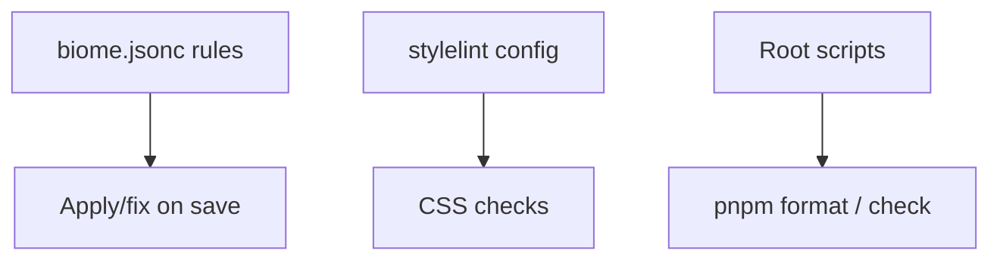

**Diagram sources**
- [biome.jsonc:1-149](file://biome.jsonc#L1-L149)
- [.stylelintrc.json:1-28](file://.stylelintrc.json#L1-L28)
- [package.json:23-25](file://package.json#L23-L25)

**Section sources**
- [biome.jsonc:1-149](file://biome.jsonc#L1-L149)
- [.stylelintrc.json:1-28](file://.stylelintrc.json#L1-L28)
- [package.json:23-25](file://package.json#L23-L25)

### Development Servers, Hot Reloading, and Proxying
- VS Code development supports desktop and web targets with concurrent watchers.
- JetBrains plugin supports running with fresh agent builds and optional split mode.
- Network traffic can be captured via proxy environment variables.

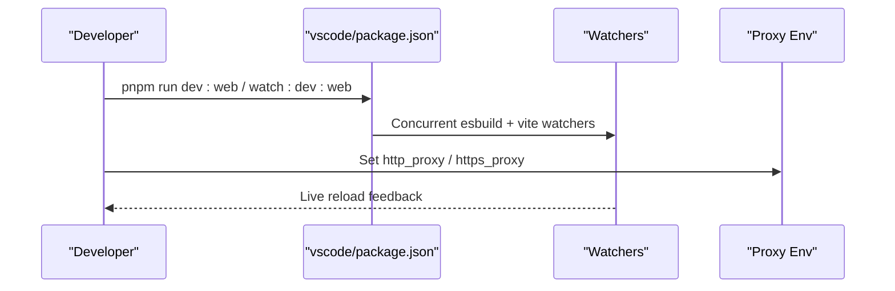

**Diagram sources**
- [vscode/package.json:19-32](file://vscode/package.json#L19-L32)
- [jetbrains/CONTRIBUTING.md:72-78](file://jetbrains/CONTRIBUTING.md#L72-L78)

**Section sources**
- [vscode/package.json:19-32](file://vscode/package.json#L19-L32)
- [jetbrains/CONTRIBUTING.md:72-78](file://jetbrains/CONTRIBUTING.md#L72-L78)

### Debugging Tools and Techniques
- VS Code extension: Chrome DevTools integration via inspect-extensions flag; dedicated Node DevTools; autocomplete trace view; export logs and heap dumps.
- JetBrains plugin: JCEF webview debugging; agent debugging via two modes (Cody spawns or IntelliJ spawns); Chrome tracing for performance.
- Agent runtime: optional remote debugging and tracing to file.

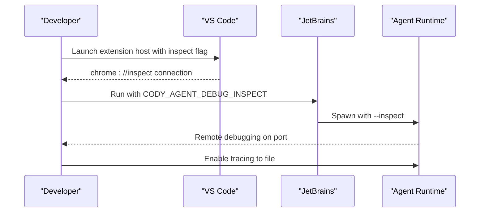

**Diagram sources**
- [vscode/CONTRIBUTING.md:88-106](file://vscode/CONTRIBUTING.md#L88-L106)
- [jetbrains/CONTRIBUTING.md:228-356](file://jetbrains/CONTRIBUTING.md#L228-L356)
- [agent/package.json:21-21](file://agent/package.json#L21-L21)

**Section sources**
- [vscode/CONTRIBUTING.md:88-123](file://vscode/CONTRIBUTING.md#L88-L123)
- [jetbrains/CONTRIBUTING.md:211-356](file://jetbrains/CONTRIBUTING.md#L211-L356)
- [agent/package.json:21-21](file://agent/package.json#L21-L21)

### Contribution Guidelines
- Code style: indentation, quotes, line width, type safety, imports, documentation, async patterns, telemetry naming, and error handling.
- Testing checklist: commands, chat UX, autocomplete, and telemetry coverage.
- VS Code and JetBrains development tips, WASM modules, and release dry-run flows.

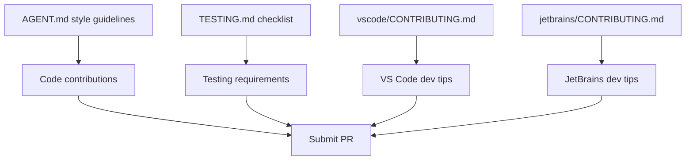

**Diagram sources**
- [AGENT.md:12-26](file://AGENT.md#L12-L26)
- [TESTING.md:1-317](file://TESTING.md#L1-L317)
- [vscode/CONTRIBUTING.md:67-87](file://vscode/CONTRIBUTING.md#L67-L87)
- [jetbrains/CONTRIBUTING.md:168-227](file://jetbrains/CONTRIBUTING.md#L168-L227)

**Section sources**
- [AGENT.md:12-26](file://AGENT.md#L12-L26)
- [TESTING.md:1-317](file://TESTING.md#L1-L317)
- [vscode/CONTRIBUTING.md:67-87](file://vscode/CONTRIBUTING.md#L67-L87)
- [jetbrains/CONTRIBUTING.md:168-227](file://jetbrains/CONTRIBUTING.md#L168-L227)

## Dependency Analysis
- Root overrides and patches ensure consistent dependency versions and compatibility.
- Root engines constrain Node and pnpm versions.
- Workspace references tie packages together for composite builds.

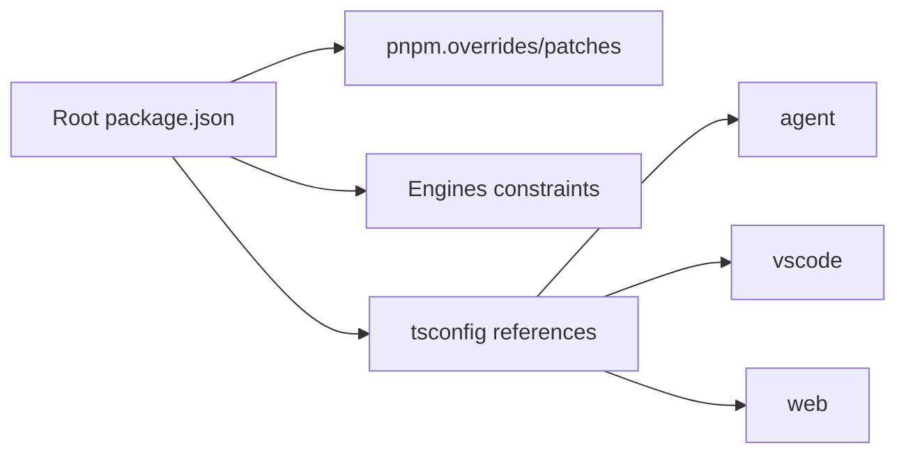

**Diagram sources**
- [package.json:84-97](file://package.json#L84-L97)
- [tsconfig.json:27-35](file://tsconfig.json#L27-L35)

**Section sources**
- [package.json:84-97](file://package.json#L84-L97)
- [tsconfig.json:27-35](file://tsconfig.json#L27-L35)

## Performance Considerations
- Use composite builds to speed up incremental compilation.
- Prefer esbuild for rapid bundling during development.
- Leverage watch mode and concurrent watchers for hot reloading.
- Use Chrome tracing to profile Agent and extension performance.

[No sources needed since this section provides general guidance]

## Troubleshooting Guide
- VS Code: enable verbose debug logging, use autocomplete trace view, export logs and heap dumps.
- JetBrains: enable JCEF debugging, adjust registry settings, and use Chrome tracing.
- Network diagnostics: configure proxy environment variables to capture extension traffic.
- Version mismatches: ensure Node and pnpm versions match engine constraints; restart Gradle daemons if needed.

**Section sources**
- [vscode/CONTRIBUTING.md:28-37](file://vscode/CONTRIBUTING.md#L28-L37)
- [jetbrains/CONTRIBUTING.md:90-103](file://jetbrains/CONTRIBUTING.md#L90-L103)
- [jetbrains/CONTRIBUTING.md:211-227](file://jetbrains/CONTRIBUTING.md#L211-L227)

## Continuous Integration and Release Management
- Root scripts provide commands for building, testing, and releasing.
- VS Code release dry-run builds a packaged extension for local verification.
- JetBrains plugin supports experimental and stable release tagging and publishing workflows.

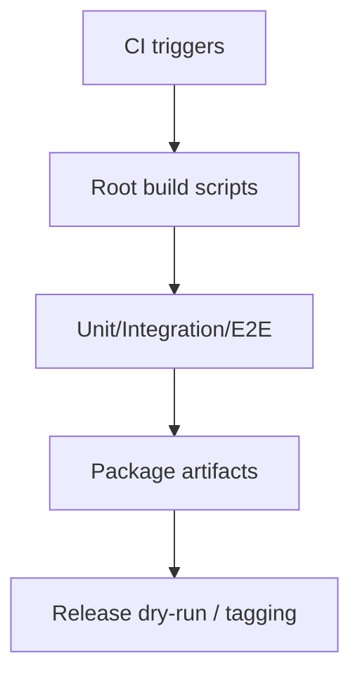

**Diagram sources**
- [package.json:18-39](file://package.json#L18-L39)
- [vscode/package.json:43-43](file://vscode/package.json#L43-L43)
- [jetbrains/CONTRIBUTING.md:168-204](file://jetbrains/CONTRIBUTING.md#L168-L204)

**Section sources**
- [package.json:18-39](file://package.json#L18-L39)
- [vscode/package.json:43-43](file://vscode/package.json#L43-L43)
- [jetbrains/CONTRIBUTING.md:168-204](file://jetbrains/CONTRIBUTING.md#L168-L204)

## Conclusion
Cody’s development workflow leverages a pnpm workspace to coordinate builds and tests across agent, VS Code, and web packages. Composite TypeScript builds, esbuild, and Vite streamline development and deployment. Robust debugging and testing tooling, combined with clear style and testing guidelines, support efficient collaboration and high-quality releases.