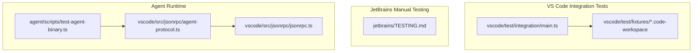
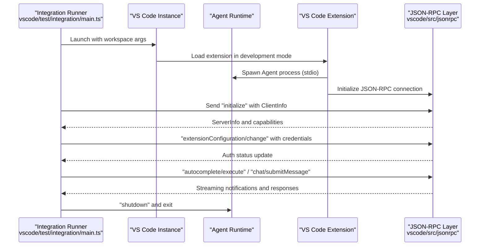
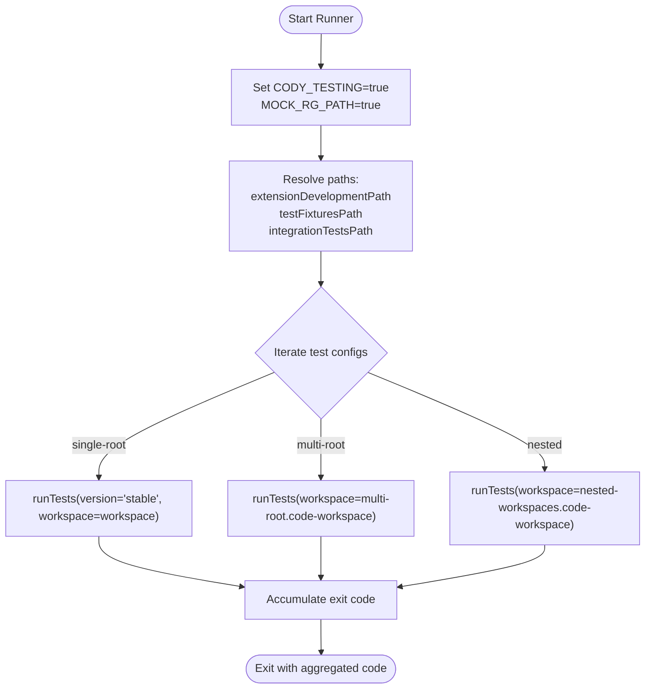
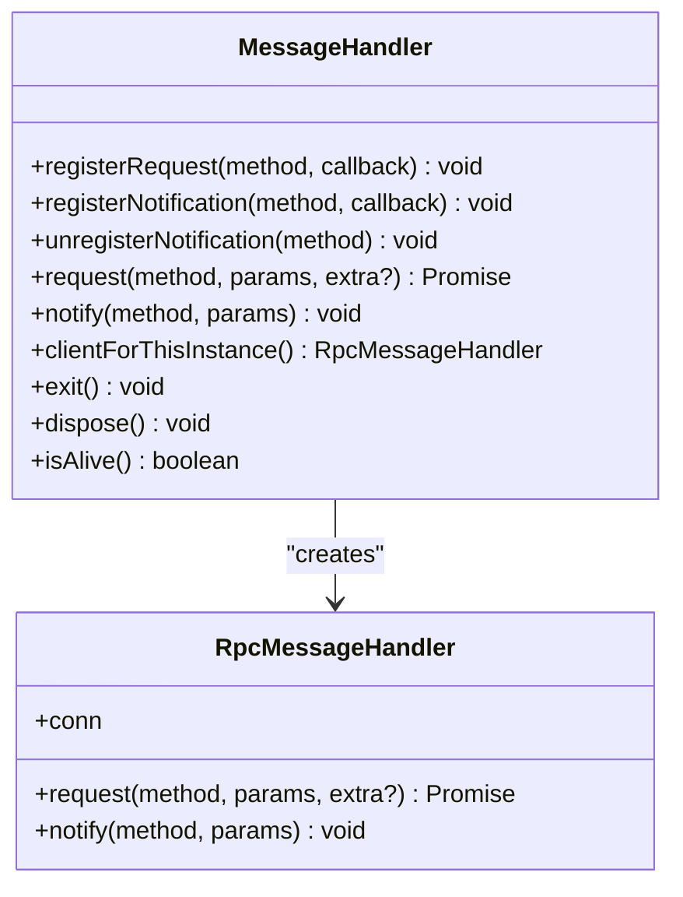
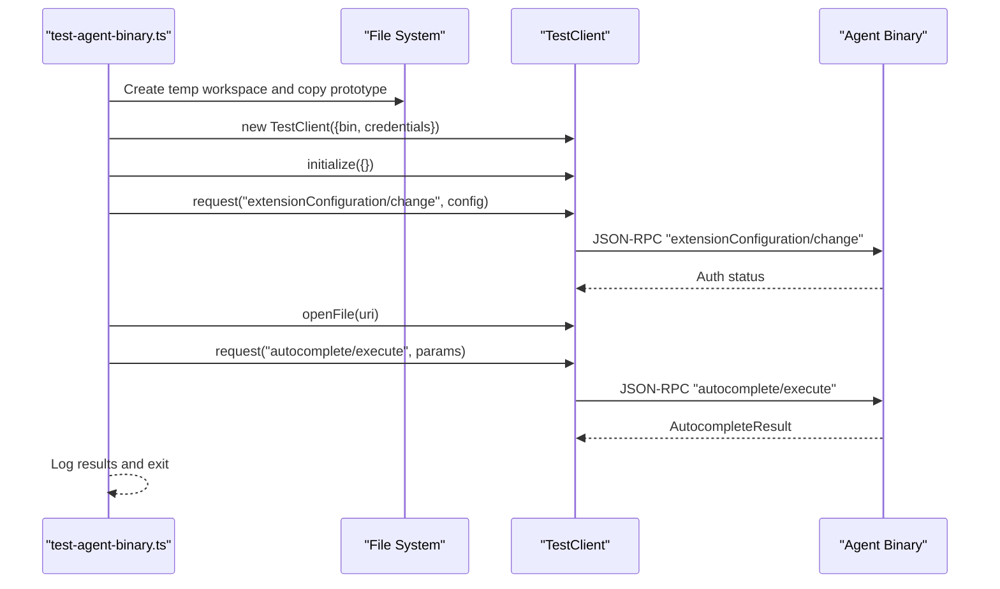
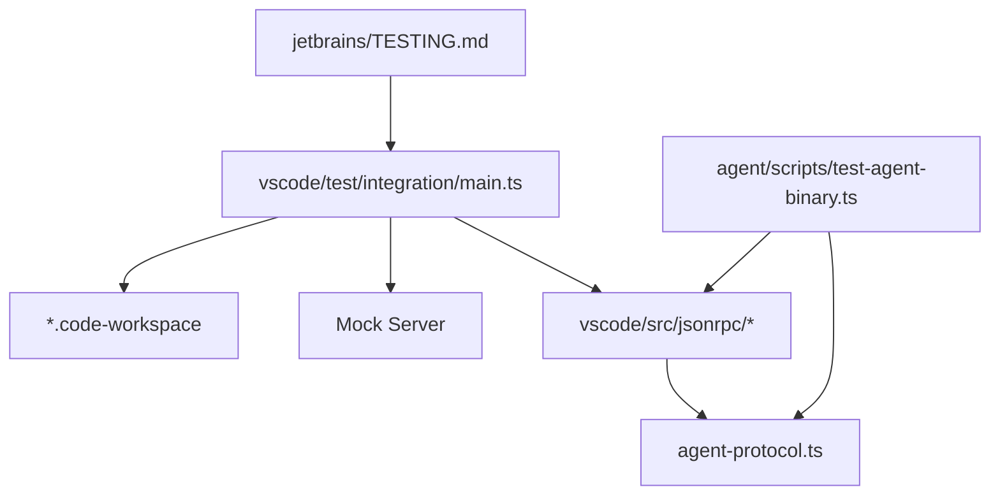

# Integration Testing

<cite>
**Referenced Files in This Document**
- [main.ts](file://vscode/test/integration/main.ts)
- [multi-root.code-workspace](file://vscode/test/fixtures/multi-root.code-workspace)
- [nested-workspaces.code-workspace](file://vscode/test/fixtures/nested-workspaces.code-workspace)
- [TESTING.md](file://jetbrains/TESTING.md)
- [test-agent-binary.ts](file://agent/scripts/test-agent-binary.ts)
- [agent-protocol.ts](file://vscode/src/jsonrpc/agent-protocol.ts)
- [jsonrpc.ts](file://vscode/src/jsonrpc/jsonrpc.ts)
- [README.md](file://agent/README.md)
- [README.md](file://vscode/README.md)
- [README.md](file://jetbrains/README.md)
- [README.md](file://README.md)
</cite>

## Table of Contents
1. [Introduction](#introduction)
2. [Project Structure](#project-structure)
3. [Core Components](#core-components)
4. [Architecture Overview](#architecture-overview)
5. [Detailed Component Analysis](#detailed-component-analysis)
6. [Dependency Analysis](#dependency-analysis)
7. [Performance Considerations](#performance-considerations)
8. [Troubleshooting Guide](#troubleshooting-guide)
9. [Conclusion](#conclusion)
10. [Appendices](#appendices)

## Introduction
This document describes integration testing strategies for Cody’s multi-platform architecture spanning the VS Code extension, JetBrains plugin, and the Agent runtime. It covers cross-component testing approaches, JSON-RPC protocol testing, authentication flows, external service integrations, end-to-end workflows (chat, autocomplete, editing), and test fixture management for single-root, multi-root, and nested workspaces. Guidance is provided for setting up test environments, managing test data, platform-specific considerations, debugging integration test failures, and optimizing test execution performance.

## Project Structure
Cody’s integration testing spans three primary areas:
- VS Code integration tests: Electron-based harness that launches a temporary VS Code instance against test workspaces and executes platform-specific tests.
- JetBrains manual testing guide: A comprehensive checklist and procedures for manual verification across UI, autocomplete, chat, commands, and platform-specific behaviors.
- Agent runtime tests and JSON-RPC protocol: Protocol definitions and JSON-RPC client/server abstractions used by the Agent and validated by tests.

**Diagram sources**
- [main.ts:1-75](file://vscode/test/integration/main.ts#L1-L75)
- [multi-root.code-workspace:1-18](file://vscode/test/fixtures/multi-root.code-workspace#L1-L18)
- [nested-workspaces.code-workspace:1-21](file://vscode/test/fixtures/nested-workspaces.code-workspace#L1-L21)
- [agent-protocol.ts:1-120](file://vscode/src/jsonrpc/agent-protocol.ts#L1-L120)
- [jsonrpc.ts:1-191](file://vscode/src/jsonrpc/jsonrpc.ts#L1-L191)
- [test-agent-binary.ts:1-111](file://agent/scripts/test-agent-binary.ts#L1-L111)

**Section sources**
- [main.ts:1-75](file://vscode/test/integration/main.ts#L1-L75)
- [multi-root.code-workspace:1-18](file://vscode/test/fixtures/multi-root.code-workspace#L1-L18)
- [nested-workspaces.code-workspace:1-21](file://vscode/test/fixtures/nested-workspaces.code-workspace#L1-L21)
- [TESTING.md:1-120](file://jetbrains/TESTING.md#L1-L120)
- [agent-protocol.ts:1-120](file://vscode/src/jsonrpc/agent-protocol.ts#L1-L120)
- [jsonrpc.ts:1-191](file://vscode/src/jsonrpc/jsonrpc.ts#L1-L191)
- [test-agent-binary.ts:1-111](file://agent/scripts/test-agent-binary.ts#L1-L111)

## Core Components
- VS Code integration test runner: Orchestrates Electron-based tests, selects workspaces, and runs platform-specific suites.
- JetBrains manual testing guide: Defines acceptance criteria and step-by-step procedures for UI and functional behaviors.
- Agent JSON-RPC protocol and client: Defines the Agent protocol surface and provides a JSON-RPC client abstraction for request/notification handling.
- Agent runtime playground: A script to exercise Agent binary interactions programmatically for quick validation.

Key responsibilities:
- Cross-component coordination: VS Code tests coordinate with Agent runtime and external services via JSON-RPC.
- Fixture-driven workspace testing: Workspaces define settings and multi-root/nested configurations for realistic integration scenarios.
- Protocol coverage: JSON-RPC protocol includes requests for chat, autocomplete, diagnostics, secrets, and testing helpers.

**Section sources**
- [main.ts:29-33](file://vscode/test/integration/main.ts#L29-L33)
- [agent-protocol.ts:24-271](file://vscode/src/jsonrpc/agent-protocol.ts#L24-L271)
- [jsonrpc.ts:40-191](file://vscode/src/jsonrpc/jsonrpc.ts#L40-L191)
- [test-agent-binary.ts:14-75](file://agent/scripts/test-agent-binary.ts#L14-L75)

## Architecture Overview
The integration testing architecture connects the VS Code extension, Agent runtime, and external services through JSON-RPC. The VS Code integration runner launches a controlled VS Code instance with a selected workspace, initializes the Agent, and exercises protocol methods for chat, autocomplete, and editing.

**Diagram sources**
- [main.ts:42-67](file://vscode/test/integration/main.ts#L42-L67)
- [agent-protocol.ts:35-271](file://vscode/src/jsonrpc/agent-protocol.ts#L35-L271)
- [jsonrpc.ts:121-136](file://vscode/src/jsonrpc/jsonrpc.ts#L121-L136)

## Detailed Component Analysis

### VS Code Integration Test Runner
The runner:
- Sets environment flags to enable testing hooks and mock external tools.
- Resolves paths for the extension, test fixtures, and integration test suites.
- Iterates over workspace configurations (single-root, multi-root, nested) and executes tests per suite.
- Uses a mock server to simulate external services during tests.

**Diagram sources**
- [main.ts:7-73](file://vscode/test/integration/main.ts#L7-L73)

**Section sources**
- [main.ts:1-75](file://vscode/test/integration/main.ts#L1-L75)
- [multi-root.code-workspace:1-18](file://vscode/test/fixtures/multi-root.code-workspace#L1-L18)
- [nested-workspaces.code-workspace:1-21](file://vscode/test/fixtures/nested-workspaces.code-workspace#L1-L21)

### JetBrains Manual Testing Guide
The JetBrains guide provides:
- Onboarding and sign-in verification across identity providers.
- Autocomplete behaviors (single-line, multi-line, infilling, cycling).
- Chat features (autoscroll, history, multiple chats, keyboard navigation).
- Inline edit dialogs, model dropdown behavior, and code lens interactions.
- Platform-specific checks for Windows and WSL.
- Multi-repo context and Cody Ignore policy testing.

This guide is essential for manual verification of UI and workflow behaviors that complement automated tests.

**Section sources**
- [TESTING.md:1-851](file://jetbrains/TESTING.md#L1-L851)

### Agent JSON-RPC Protocol and Client
The Agent protocol defines:
- Requests: initialization, chat operations, autocomplete, diagnostics, secrets, telemetry, and testing helpers.
- Notifications: lifecycle, document changes, progress, webview messaging, and auth status updates.
- Types: positions, ranges, authentication status, telemetry events, and workspace/document models.

The JSON-RPC client abstraction:
- Registers request and notification handlers.
- Sends requests and notifications with cancellation support.
- Provides an in-process client for direct invocation within the same process.

**Diagram sources**
- [jsonrpc.ts:40-191](file://vscode/src/jsonrpc/jsonrpc.ts#L40-L191)

**Section sources**
- [agent-protocol.ts:24-472](file://vscode/src/jsonrpc/agent-protocol.ts#L24-L472)
- [jsonrpc.ts:1-191](file://vscode/src/jsonrpc/jsonrpc.ts#L1-L191)

### Agent Runtime Playground Script
The playground script demonstrates:
- Creating a temporary workspace and copying a prototype.
- Spawning a TestClient connected to an Agent binary.
- Initializing the Agent and updating extension configuration.
- Executing autocomplete and verifying responses.

**Diagram sources**
- [test-agent-binary.ts:14-75](file://agent/scripts/test-agent-binary.ts#L14-L75)
- [agent-protocol.ts:130-131](file://vscode/src/jsonrpc/agent-protocol.ts#L130-L131)

**Section sources**
- [test-agent-binary.ts:1-111](file://agent/scripts/test-agent-binary.ts#L1-L111)
- [agent-protocol.ts:130-131](file://vscode/src/jsonrpc/agent-protocol.ts#L130-L131)

## Dependency Analysis
Integration testing depends on:
- Workspace fixtures to define environment settings and multi-root/nested layouts.
- JSON-RPC protocol to communicate between the extension and Agent.
- External services mocked via a mock server in the runner.
- Platform-specific behaviors verified by JetBrains manual guide.

**Diagram sources**
- [main.ts:42-67](file://vscode/test/integration/main.ts#L42-L67)
- [multi-root.code-workspace:10-16](file://vscode/test/fixtures/multi-root.code-workspace#L10-L16)
- [nested-workspaces.code-workspace:13-19](file://vscode/test/fixtures/nested-workspaces.code-workspace#L13-L19)
- [agent-protocol.ts:24-271](file://vscode/src/jsonrpc/agent-protocol.ts#L24-L271)
- [jsonrpc.ts:1-191](file://vscode/src/jsonrpc/jsonrpc.ts#L1-L191)
- [test-agent-binary.ts:14-75](file://agent/scripts/test-agent-binary.ts#L14-L75)
- [TESTING.md:1-120](file://jetbrains/TESTING.md#L1-L120)

**Section sources**
- [main.ts:29-33](file://vscode/test/integration/main.ts#L29-L33)
- [multi-root.code-workspace:10-16](file://vscode/test/fixtures/multi-root.code-workspace#L10-L16)
- [nested-workspaces.code-workspace:13-19](file://vscode/test/fixtures/nested-workspaces.code-workspace#L13-L19)
- [agent-protocol.ts:24-271](file://vscode/src/jsonrpc/agent-protocol.ts#L24-L271)
- [jsonrpc.ts:1-191](file://vscode/src/jsonrpc/jsonrpc.ts#L1-L191)
- [test-agent-binary.ts:14-75](file://agent/scripts/test-agent-binary.ts#L14-L75)
- [TESTING.md:1-120](file://jetbrains/TESTING.md#L1-L120)

## Performance Considerations
- Use stable VS Code version for integration tests to align with user environments and reduce flakiness caused by IDE changes.
- Minimize external tool dependencies by mocking or stubbing where possible (e.g., rg path).
- Reduce test scope to targeted suites per workspace configuration to shorten feedback loops.
- Leverage in-process JSON-RPC client for rapid validation without spawning Agent processes.
- Cache and reuse temporary workspaces when feasible to avoid repeated setup overhead.

[No sources needed since this section provides general guidance]

## Troubleshooting Guide
Common issues and remedies:
- Authentication failures: Verify credentials and server endpoint in extension configuration requests. Check protocol auth status updates and error payloads.
- JSON-RPC timeouts or disconnects: Ensure the Agent process is healthy and the connection is established before sending requests. Use cancellation tokens for long-running operations.
- Workspace synchronization errors: Use testing-only requests to validate document state and synchronize client/server document copies.
- Mock server connectivity: Confirm the mock server is running and reachable; adjust network settings or proxy configuration if needed.
- Platform-specific failures: Validate Windows/WSL paths and repository recognition in JetBrains tests.

**Section sources**
- [agent-protocol.ts:226-229](file://vscode/src/jsonrpc/agent-protocol.ts#L226-L229)
- [jsonrpc.ts:69-88](file://vscode/src/jsonrpc/jsonrpc.ts#L69-L88)
- [test-agent-binary.ts:52-54](file://agent/scripts/test-agent-binary.ts#L52-L54)

## Conclusion
Cody’s integration testing strategy combines automated VS Code integration tests, JetBrains manual testing procedures, and Agent JSON-RPC protocol validation. By leveraging workspace fixtures, JSON-RPC protocol coverage, and platform-specific guidance, teams can comprehensively verify cross-component behavior, authentication flows, and end-to-end workflows across VS Code, JetBrains, and the Agent runtime.

[No sources needed since this section summarizes without analyzing specific files]

## Appendices

### Appendix A: Setting Up Test Environments
- VS Code integration tests:
  - Install dependencies and run the integration runner script to launch VS Code with selected workspaces.
  - Configure environment variables for testing hooks and external tool mocking.
- JetBrains manual tests:
  - Follow the manual testing guide to validate UI and workflow behaviors across platforms.
- Agent runtime tests:
  - Use the playground script to quickly exercise Agent binary interactions and protocol methods.

**Section sources**
- [main.ts:7-13](file://vscode/test/integration/main.ts#L7-L13)
- [TESTING.md:1-120](file://jetbrains/TESTING.md#L1-L120)
- [test-agent-binary.ts:14-40](file://agent/scripts/test-agent-binary.ts#L14-L40)

### Appendix B: Managing Test Data and Workspaces
- Single-root, multi-root, and nested workspace configurations are defined in code-workspace files and loaded by the integration runner.
- Workspace settings include server endpoint, command code lenses, and internal unstable flags for consistent test behavior.

**Section sources**
- [multi-root.code-workspace:10-16](file://vscode/test/fixtures/multi-root.code-workspace#L10-L16)
- [nested-workspaces.code-workspace:13-19](file://vscode/test/fixtures/nested-workspaces.code-workspace#L13-L19)

### Appendix C: Cross-Component Testing Strategies
- VS Code extension ↔ Agent runtime:
  - Initialize JSON-RPC connection, configure extension settings, and exercise chat and autocomplete requests.
- JetBrains plugin ↔ external services:
  - Validate UI behaviors, autocomplete, chat, and inline edit workflows using the manual testing guide.
- Shared protocol:
  - Use the JSON-RPC protocol definitions to ensure consistent request/response semantics across clients.

**Section sources**
- [agent-protocol.ts:24-271](file://vscode/src/jsonrpc/agent-protocol.ts#L24-L271)
- [jsonrpc.ts:121-136](file://vscode/src/jsonrpc/jsonrpc.ts#L121-L136)
- [TESTING.md:1-120](file://jetbrains/TESTING.md#L1-L120)