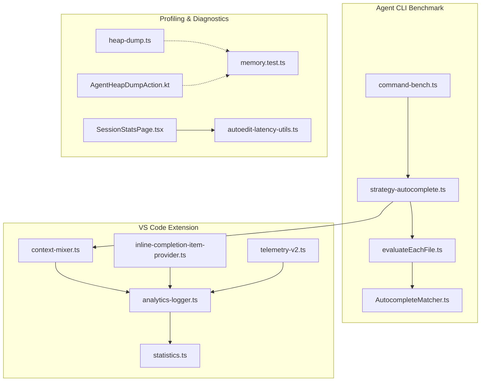
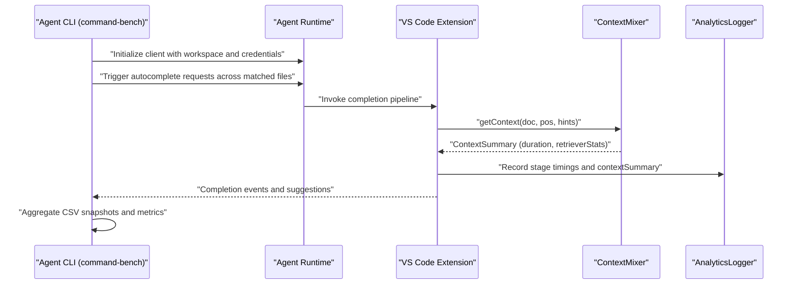
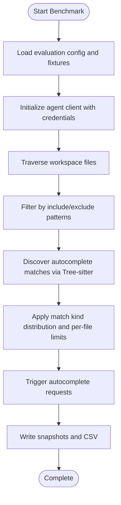
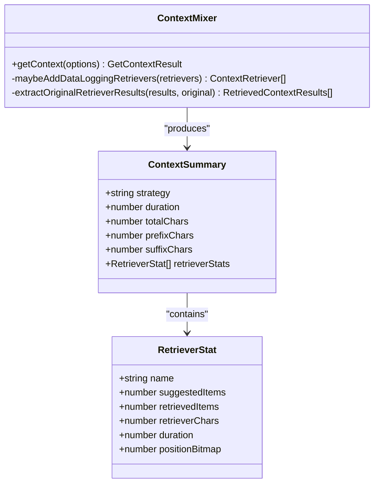
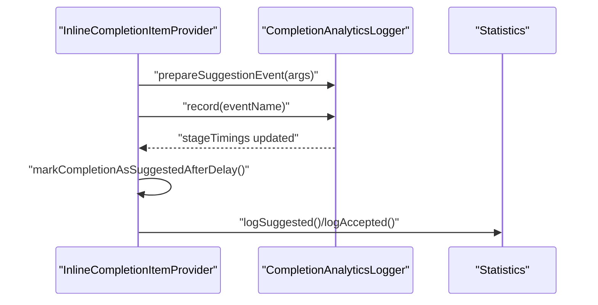
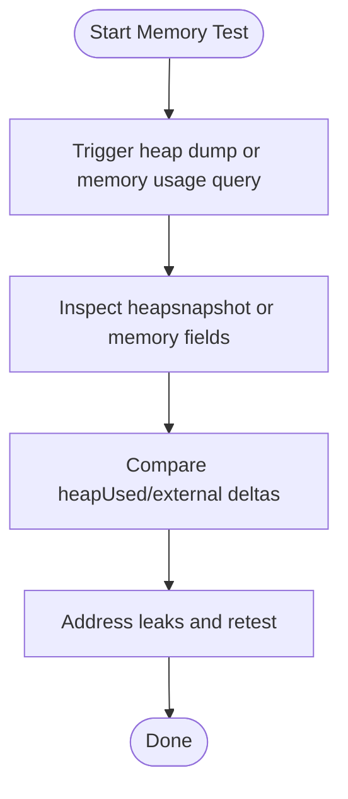
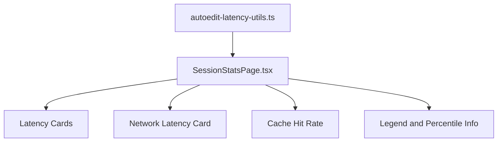
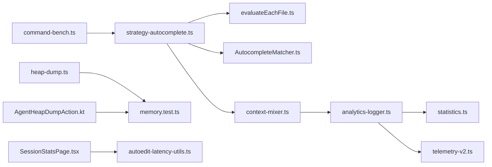

# Performance Testing

<cite>
**Referenced Files in This Document**
- [command-bench.ts](file://agent/src/cli/command-bench/command-bench.ts)
- [strategy-autocomplete.ts](file://agent/src/cli/command-bench/strategy-autocomplete.ts)
- [evaluateEachFile.ts](file://agent/src/cli/command-bench/evaluateEachFile.ts)
- [AutocompleteMatcher.ts](file://agent/src/cli/command-bench/AutocompleteMatcher.ts)
- [context-mixer.ts](file://vscode/src/completions/context/context-mixer.ts)
- [analytics-logger.ts](file://vscode/src/completions/analytics-logger.ts)
- [statistics.ts](file://vscode/src/completions/statistics.ts)
- [inline-completion-item-provider.ts](file://vscode/src/completions/inline-completion-item-provider.ts)
- [heap-dump.ts](file://vscode/src/services/heap-dump.ts)
- [AgentHeapDumpAction.kt](file://jetbrains/src/main/kotlin/com/sourcegraph/cody/debugging/AgentHeapDumpAction.kt)
- [memory.test.ts](file://agent/src/memory.test.ts)
- [SessionStatsPage.tsx](file://vscode/webviews/autoedit-debug/session-stats/SessionStatsPage.tsx)
- [autoedit-latency-utils.ts](file://vscode/src/autoedits/debug-panel/autoedit-latency-utils.ts)
- [mock-server.ts](file://vscode/test/fixtures/mock-server.ts)
- [limiter.test.ts](file://vscode/src/graph/lsp/limiter.test.ts)
- [telemetry-v2.ts](file://vscode/src/services/telemetry-v2.ts)
</cite>

## Table of Contents
1. [Introduction](#introduction)
2. [Project Structure](#project-structure)
3. [Core Components](#core-components)
4. [Architecture Overview](#architecture-overview)
5. [Detailed Component Analysis](#detailed-component-analysis)
6. [Dependency Analysis](#dependency-analysis)
7. [Performance Considerations](#performance-considerations)
8. [Troubleshooting Guide](#troubleshooting-guide)
9. [Conclusion](#conclusion)
10. [Appendices](#appendices)

## Introduction
This document describes performance testing methodologies for Cody’s AI-powered development platform. It covers load testing for autocomplete engines, chat systems, and code editing operations; memory profiling for the VS Code extension and agent runtime; benchmarking for completion latency, context retrieval speed, and UI responsiveness; stress testing scenarios; and guidance on monitoring, profiling, optimization, and continuous performance measurement.

## Project Structure
Performance testing spans CLI benchmarking tools, VS Code extension telemetry and analytics, and agent-side memory diagnostics. The key areas are:
- Agent CLI benchmarking for autocomplete and related flows
- VS Code extension telemetry and analytics for latency and throughput
- Context retrieval and ranking with built-in timing instrumentation
- Memory profiling via heap dumps and memory usage APIs
- UI responsiveness and latency visualization in debug panels

**Diagram sources**
- [command-bench.ts:146-458](file://agent/src/cli/command-bench/command-bench.ts#L146-L458)
- [strategy-autocomplete.ts:11-96](file://agent/src/cli/command-bench/strategy-autocomplete.ts#L11-L96)
- [evaluateEachFile.ts:39-88](file://agent/src/cli/command-bench/evaluateEachFile.ts#L39-L88)
- [AutocompleteMatcher.ts:23-41](file://agent/src/cli/command-bench/AutocompleteMatcher.ts#L23-L41)
- [context-mixer.ts:107-244](file://vscode/src/completions/context/context-mixer.ts#L107-L244)
- [analytics-logger.ts:1319-1344](file://vscode/src/completions/analytics-logger.ts#L1319-L1344)
- [statistics.ts:15-29](file://vscode/src/completions/statistics.ts#L15-L29)
- [inline-completion-item-provider.ts:749-784](file://vscode/src/completions/inline-completion-item-provider.ts#L749-L784)
- [telemetry-v2.ts:26-99](file://vscode/src/services/telemetry-v2.ts#L26-L99)
- [heap-dump.ts:1-45](file://vscode/src/services/heap-dump.ts#L1-L45)
- [AgentHeapDumpAction.kt:1-11](file://jetbrains/src/main/kotlin/com/sourcegraph/cody/debugging/AgentHeapDumpAction.kt#L1-L11)
- [memory.test.ts:13-147](file://agent/src/memory.test.ts#L13-L147)
- [SessionStatsPage.tsx:1-370](file://vscode/webviews/autoedit-debug/session-stats/SessionStatsPage.tsx#L1-L370)
- [autoedit-latency-utils.ts:232-273](file://vscode/src/autoedits/debug-panel/autoedit-latency-utils.ts#L232-L273)

**Section sources**
- [command-bench.ts:146-458](file://agent/src/cli/command-bench/command-bench.ts#L146-L458)
- [context-mixer.ts:107-244](file://vscode/src/completions/context/context-mixer.ts#L107-L244)
- [analytics-logger.ts:1319-1344](file://vscode/src/completions/analytics-logger.ts#L1319-L1344)

## Core Components
- Agent CLI benchmarking orchestrates end-to-end evaluations for autocomplete, chat, and related flows in a headless agent environment. It supports configuration-driven workspaces, snapshotting, and Polly replay/recording for stable network behavior.
- VS Code extension tracks completion stages, context retrieval durations, and suggestion acceptance rates. It emits telemetry and maintains counters for latency breakdowns.
- Context mixer measures per-retriever and total context retrieval durations and aggregates statistics for analytics.
- Memory profiling utilities provide heap dump actions and memory usage queries for detecting leaks during long-running sessions and replays.

**Section sources**
- [command-bench.ts:33-79](file://agent/src/cli/command-bench/command-bench.ts#L33-L79)
- [context-mixer.ts:31-71](file://vscode/src/completions/context/context-mixer.ts#L31-L71)
- [analytics-logger.ts:148-195](file://vscode/src/completions/analytics-logger.ts#L148-L195)
- [statistics.ts:5-29](file://vscode/src/completions/statistics.ts#L5-L29)
- [heap-dump.ts:1-45](file://vscode/src/services/heap-dump.ts#L1-L45)
- [memory.test.ts:13-147](file://agent/src/memory.test.ts#L13-L147)

## Architecture Overview
The performance testing architecture integrates CLI-driven headless evaluations with VS Code telemetry and analytics. The agent runs evaluations against a configured workspace, triggering autocomplete and related flows. The extension records stage timings, context retrieval durations, and suggestion analytics. Profiling tools capture memory usage and produce heap snapshots for leak detection.

**Diagram sources**
- [command-bench.ts:369-458](file://agent/src/cli/command-bench/command-bench.ts#L369-L458)
- [strategy-autocomplete.ts:11-96](file://agent/src/cli/command-bench/strategy-autocomplete.ts#L11-L96)
- [context-mixer.ts:107-244](file://vscode/src/completions/context/context-mixer.ts#L107-L244)
- [analytics-logger.ts:1319-1344](file://vscode/src/completions/analytics-logger.ts#L1319-L1344)

## Detailed Component Analysis

### Autocomplete Load Testing (Agent CLI)
The CLI benchmark orchestrates large-scale autocomplete evaluations:
- Workspace traversal and file filtering by language/filepath globs
- Match discovery using Tree-sitter queries to generate autocomplete triggers
- Headless request generation with configurable limits per file and distribution controls
- Snapshot writing and CSV aggregation for downstream analysis

**Diagram sources**
- [command-bench.ts:298-458](file://agent/src/cli/command-bench/command-bench.ts#L298-L458)
- [strategy-autocomplete.ts:11-96](file://agent/src/cli/command-bench/strategy-autocomplete.ts#L11-L96)
- [evaluateEachFile.ts:39-88](file://agent/src/cli/command-bench/evaluateEachFile.ts#L39-L88)
- [AutocompleteMatcher.ts:23-41](file://agent/src/cli/command-bench/AutocompleteMatcher.ts#L23-L41)

**Section sources**
- [command-bench.ts:146-458](file://agent/src/cli/command-bench/command-bench.ts#L146-L458)
- [strategy-autocomplete.ts:11-96](file://agent/src/cli/command-bench/strategy-autocomplete.ts#L11-L96)
- [evaluateEachFile.ts:39-88](file://agent/src/cli/command-bench/evaluateEachFile.ts#L39-L88)
- [AutocompleteMatcher.ts:11-41](file://agent/src/cli/command-bench/AutocompleteMatcher.ts#L11-L41)

### Context Retrieval and Latency Measurement
The context mixer measures per-retriever and total retrieval durations and exposes retriever statistics for analytics:
- Per-retriever timing and character counts
- Position bitmap for first 32 results
- Aggregated ContextSummary for analytics and UI

**Diagram sources**
- [context-mixer.ts:88-244](file://vscode/src/completions/context/context-mixer.ts#L88-L244)
- [context-mixer.ts:31-71](file://vscode/src/completions/context/context-mixer.ts#L31-L71)

**Section sources**
- [context-mixer.ts:107-244](file://vscode/src/completions/context/context-mixer.ts#L107-L244)

### Completion Analytics and Stage Timings
Completion analytics records stage timings across the autocomplete pipeline and exposes counters for suggestion lifecycle events:
- Stage timing recording keyed by pipeline stages
- Suggestion event preparation and delayed marking
- Acceptance and suggestion counters for throughput

**Diagram sources**
- [analytics-logger.ts:1319-1344](file://vscode/src/completions/analytics-logger.ts#L1319-L1344)
- [inline-completion-item-provider.ts:749-784](file://vscode/src/completions/inline-completion-item-provider.ts#L749-L784)
- [statistics.ts:15-29](file://vscode/src/completions/statistics.ts#L15-L29)

**Section sources**
- [analytics-logger.ts:1319-1344](file://vscode/src/completions/analytics-logger.ts#L1319-L1344)
- [inline-completion-item-provider.ts:749-784](file://vscode/src/completions/inline-completion-item-provider.ts#L749-L784)
- [statistics.ts:5-29](file://vscode/src/completions/statistics.ts#L5-L29)

### Memory Profiling and Leak Detection
Memory profiling is supported via:
- Heap dump actions for VS Code and JetBrains
- Memory usage queries in the agent
- Replay-based memory leak tests

**Diagram sources**
- [heap-dump.ts:1-45](file://vscode/src/services/heap-dump.ts#L1-L45)
- [AgentHeapDumpAction.kt:1-11](file://jetbrains/src/main/kotlin/com/sourcegraph/cody/debugging/AgentHeapDumpAction.kt#L1-L11)
- [memory.test.ts:13-147](file://agent/src/memory.test.ts#L13-L147)

**Section sources**
- [heap-dump.ts:1-45](file://vscode/src/services/heap-dump.ts#L1-L45)
- [AgentHeapDumpAction.kt:1-11](file://jetbrains/src/main/kotlin/com/sourcegraph/cody/debugging/AgentHeapDumpAction.kt#L1-L11)
- [memory.test.ts:13-147](file://agent/src/memory.test.ts#L13-L147)

### UI Responsiveness and Latency Visualization
The autoedit debug panel surfaces latency percentiles and thresholds for end-to-end, context loading, network, inference, and Envoy upstream latency. It also displays cache hit rate trends and provides guidance on interpreting percentiles.

**Diagram sources**
- [SessionStatsPage.tsx:1-370](file://vscode/webviews/autoedit-debug/session-stats/SessionStatsPage.tsx#L1-L370)
- [autoedit-latency-utils.ts:232-273](file://vscode/src/autoedits/debug-panel/autoedit-latency-utils.ts#L232-L273)

**Section sources**
- [SessionStatsPage.tsx:1-370](file://vscode/webviews/autoedit-debug/session-stats/SessionStatsPage.tsx#L1-L370)
- [autoedit-latency-utils.ts:232-273](file://vscode/src/autoedits/debug-panel/autoedit-latency-utils.ts#L232-L273)

## Dependency Analysis
- CLI benchmark depends on agent client initialization, Polly recording/replay, and strategy modules for different evaluation types.
- Extension analytics depend on context mixer for context summaries and telemetry provider for event recording.
- Memory diagnostics rely on platform-specific heap dump actions and agent memory usage endpoints.

**Diagram sources**
- [command-bench.ts:146-458](file://agent/src/cli/command-bench/command-bench.ts#L146-L458)
- [strategy-autocomplete.ts:11-96](file://agent/src/cli/command-bench/strategy-autocomplete.ts#L11-L96)
- [evaluateEachFile.ts:39-88](file://agent/src/cli/command-bench/evaluateEachFile.ts#L39-L88)
- [AutocompleteMatcher.ts:23-41](file://agent/src/cli/command-bench/AutocompleteMatcher.ts#L23-L41)
- [context-mixer.ts:107-244](file://vscode/src/completions/context/context-mixer.ts#L107-L244)
- [analytics-logger.ts:1319-1344](file://vscode/src/completions/analytics-logger.ts#L1319-L1344)
- [statistics.ts:15-29](file://vscode/src/completions/statistics.ts#L15-L29)
- [telemetry-v2.ts:26-99](file://vscode/src/services/telemetry-v2.ts#L26-L99)
- [heap-dump.ts:1-45](file://vscode/src/services/heap-dump.ts#L1-L45)
- [AgentHeapDumpAction.kt:1-11](file://jetbrains/src/main/kotlin/com/sourcegraph/cody/debugging/AgentHeapDumpAction.kt#L1-L11)
- [memory.test.ts:13-147](file://agent/src/memory.test.ts#L13-L147)
- [SessionStatsPage.tsx:1-370](file://vscode/webviews/autoedit-debug/session-stats/SessionStatsPage.tsx#L1-L370)
- [autoedit-latency-utils.ts:232-273](file://vscode/src/autoedits/debug-panel/autoedit-latency-utils.ts#L232-L273)

**Section sources**
- [command-bench.ts:146-458](file://agent/src/cli/command-bench/command-bench.ts#L146-L458)
- [context-mixer.ts:107-244](file://vscode/src/completions/context/context-mixer.ts#L107-L244)
- [analytics-logger.ts:1319-1344](file://vscode/src/completions/analytics-logger.ts#L1319-L1344)

## Performance Considerations
- Autocomplete latency breakdowns: pre-last candidate, pre-cache, pre-debounce, pre-context retrieval, pre-network request. These stages are recorded and surfaced via analytics and telemetry.
- Context retrieval: measure retriever durations and total context mixing time; use retrieverStats to identify bottlenecks.
- UI responsiveness: track percentiles and thresholds for end-to-end, context loading, network, inference, and Envoy upstream latency; monitor cache hit rates.
- Stress scenarios: large codebases, concurrent users, and constrained environments can be simulated with CLI benchmarks and network middleware.

[No sources needed since this section provides general guidance]

## Troubleshooting Guide
- Network issues simulation: use mock server middleware to inject connection failures and observe client resilience.
- Request timeouts: validate limiter behavior under heavy load to ensure graceful degradation.
- Memory leaks: run replay-based tests and compare heapUsed/external deltas; use heap dump actions to capture snapshots.

**Section sources**
- [mock-server.ts:206-229](file://vscode/test/fixtures/mock-server.ts#L206-L229)
- [limiter.test.ts:48-107](file://vscode/src/graph/lsp/limiter.test.ts#L48-L107)
- [memory.test.ts:13-147](file://agent/src/memory.test.ts#L13-L147)

## Conclusion
Cody’s performance testing stack combines CLI-driven headless evaluations, extension-side analytics and telemetry, and diagnostic tools for memory and latency. By leveraging stage timings, retriever statistics, and UI latency cards, teams can continuously measure and optimize completion latency, context retrieval speed, and UI responsiveness. Stress testing and memory profiling help uncover regressions and guide targeted optimizations.

[No sources needed since this section summarizes without analyzing specific files]

## Appendices

### Performance Monitoring Tools and Techniques
- Telemetry and analytics: use telemetry recorder provider and analytics logger to capture stage timings and suggestion lifecycles.
- Latency visualization: consume percentile metrics and thresholds from the autoedit debug panel.
- Memory diagnostics: trigger heap dumps and compare memory usage deltas across scenarios.

**Section sources**
- [telemetry-v2.ts:26-99](file://vscode/src/services/telemetry-v2.ts#L26-L99)
- [analytics-logger.ts:148-195](file://vscode/src/completions/analytics-logger.ts#L148-L195)
- [SessionStatsPage.tsx:1-370](file://vscode/webviews/autoedit-debug/session-stats/SessionStatsPage.tsx#L1-L370)
- [heap-dump.ts:1-45](file://vscode/src/services/heap-dump.ts#L1-L45)
- [AgentHeapDumpAction.kt:1-11](file://jetbrains/src/main/kotlin/com/sourcegraph/cody/debugging/AgentHeapDumpAction.kt#L1-L11)
- [memory.test.ts:13-147](file://agent/src/memory.test.ts#L13-L147)