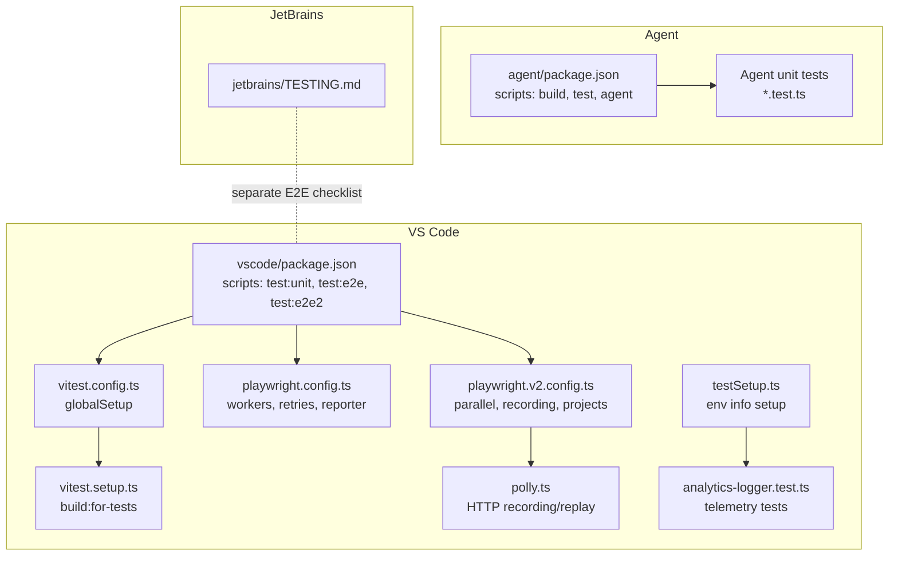
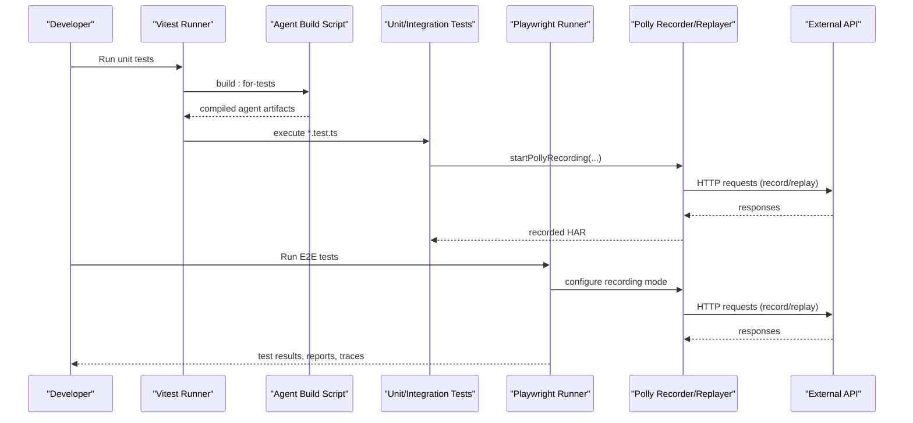
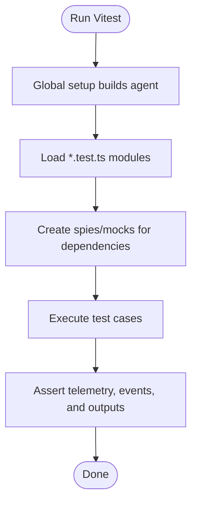
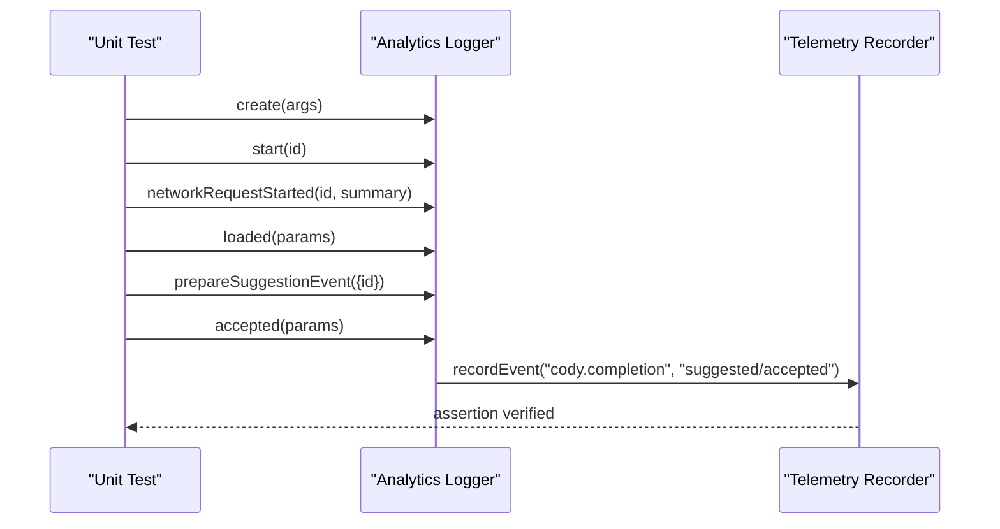
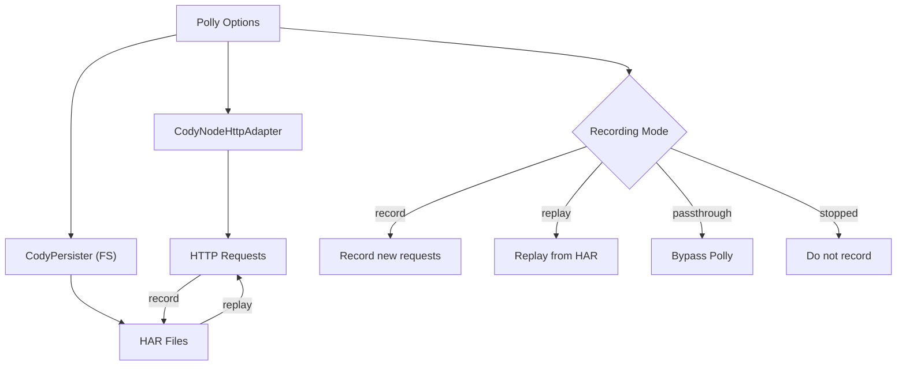
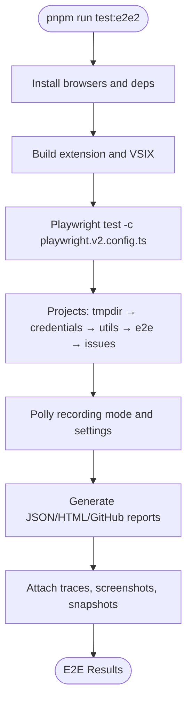
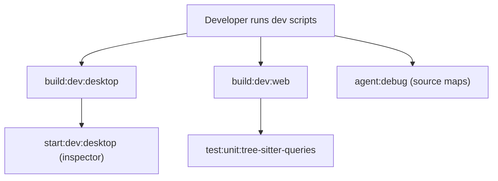
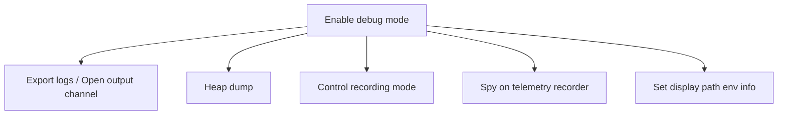
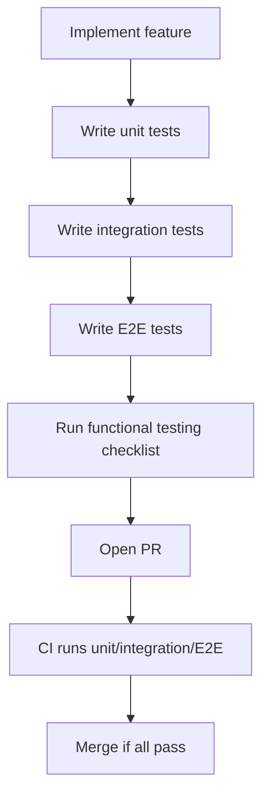
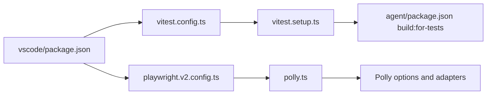

# Testing & Development

<cite>
**Referenced Files in This Document**
- [TESTING.md](file://TESTING.md)
- [vitest.config.ts](file://vitest.config.ts)
- [vitest.setup.ts](file://vitest.setup.ts)
- [playwright.config.ts](file://vscode/playwright.config.ts)
- [playwright.v2.config.ts](file://vscode/playwright.v2.config.ts)
- [package.json](file://vscode/package.json)
- [agent/package.json](file://agent/package.json)
- [testSetup.ts](file://vscode/src/testutils/testSetup.ts)
- [polly.ts](file://vscode/src/testutils/polly.ts)
- [analytics-logger.test.ts](file://vscode/src/completions/analytics-logger.test.ts)
</cite>

## Table of Contents
1. [Introduction](#introduction)
2. [Project Structure](#project-structure)
3. [Core Components](#core-components)
4. [Architecture Overview](#architecture-overview)
5. [Detailed Component Analysis](#detailed-component-analysis)
6. [Dependency Analysis](#dependency-analysis)
7. [Performance Considerations](#performance-considerations)
8. [Troubleshooting Guide](#troubleshooting-guide)
9. [Conclusion](#conclusion)
10. [Appendices](#appendices)

## Introduction
This document describes Cody’s testing strategy and development workflow across unit, integration, and end-to-end (E2E) testing. It covers:
- Unit testing approaches for components, services, and utilities, including mocking strategies
- Integration testing for cross-component interactions and API integration
- End-to-end scenarios using Playwright with Polly-based HTTP recording/replay
- Performance testing, load testing, memory profiling, and performance benchmarks
- Development environment setup, build system configuration, and development server usage
- Debugging tools and techniques including log analysis, performance profiling, and network troubleshooting
- Contribution guidelines, code style standards, commit conventions, and pull request processes
- Continuous integration pipeline, automated testing, and quality gates
- Practical examples and troubleshooting guidance for writing effective tests and resolving common issues

## Project Structure
Cody’s repository includes multiple packages and testing frameworks:
- Agent package: CLI and agent runtime with unit tests and CLI benchmark utilities
- VS Code extension: Web and Node builds, extensive unit and E2E tests
- JetBrains plugin: Separate testing documentation and E2E flows
- Shared libraries: Cross-platform utilities and telemetry

Key testing-related areas:
- Vitest configuration and global setup for building agent binaries before tests
- Playwright configuration for E2E tests with parallelism, retries, and Polly-based HTTP recordings
- Package scripts for running unit, integration, and E2E tests
- Test utilities for Polly HTTP recording, environment setup, and analytics logging tests

**Diagram sources**
- [agent/package.json:13-26](file://agent/package.json#L13-L26)
- [vscode/package.json:45-56](file://vscode/package.json#L45-L56)
- [vitest.config.ts:1-8](file://vitest.config.ts#L1-L8)
- [vitest.setup.ts:1-14](file://vitest.setup.ts#L1-L14)
- [playwright.config.ts:1-20](file://vscode/playwright.config.ts#L1-L20)
- [playwright.v2.config.ts:1-169](file://vscode/playwright.v2.config.ts#L1-L169)
- [polly.ts:1-120](file://vscode/src/testutils/polly.ts#L1-L120)
- [testSetup.ts:1-13](file://vscode/src/testutils/testSetup.ts#L1-L13)
- [analytics-logger.test.ts:1-298](file://vscode/src/completions/analytics-logger.test.ts#L1-L298)

**Section sources**
- [agent/package.json:13-26](file://agent/package.json#L13-L26)
- [vscode/package.json:45-56](file://vscode/package.json#L45-L56)
- [vitest.config.ts:1-8](file://vitest.config.ts#L1-L8)
- [vitest.setup.ts:1-14](file://vitest.setup.ts#L1-L14)
- [playwright.config.ts:1-20](file://vscode/playwright.config.ts#L1-L20)
- [playwright.v2.config.ts:1-169](file://vscode/playwright.v2.config.ts#L1-L169)
- [polly.ts:1-120](file://vscode/src/testutils/polly.ts#L1-L120)
- [testSetup.ts:1-13](file://vscode/src/testutils/testSetup.ts#L1-L13)
- [analytics-logger.test.ts:1-298](file://vscode/src/completions/analytics-logger.test.ts#L1-L298)

## Core Components
- Unit testing framework: Vitest
- E2E testing framework: Playwright
- HTTP recording/replay: PollyJS with custom adapter and persister
- Build orchestration: pnpm scripts in both agent and VS Code packages
- Environment initialization: global setup for Vitest and Playwright projects

Key capabilities:
- Global agent build for tests via Vitest setup
- Parallel E2E runs with configurable retries and recording modes
- Stable request matching for Polly by canonicalizing JSON bodies and redacting sensitive headers
- Snapshot paths aligned with test directories for deterministic E2E snapshots

**Section sources**
- [vitest.setup.ts:1-14](file://vitest.setup.ts#L1-L14)
- [vitest.config.ts:1-8](file://vitest.config.ts#L1-L8)
- [playwright.v2.config.ts:33-104](file://vscode/playwright.v2.config.ts#L33-L104)
- [polly.ts:20-85](file://vscode/src/testutils/polly.ts#L20-L85)

## Architecture Overview
The testing architecture integrates unit, integration, and E2E layers with robust HTTP recording and replay.

**Diagram sources**
- [vitest.setup.ts:4-12](file://vitest.setup.ts#L4-L12)
- [agent/package.json:16-17](file://agent/package.json#L16-L17)
- [playwright.v2.config.ts:50-104](file://vscode/playwright.v2.config.ts#L50-L104)
- [polly.ts:20-41](file://vscode/src/testutils/polly.ts#L20-L41)

## Detailed Component Analysis

### Unit Testing Strategy
- Framework: Vitest
- Scope: Component, service, and utility tests across agent and VS Code packages
- Mocking: Spy-based and module mocking for telemetry, HTTP adapters, and environment setup
- Global setup: Builds agent binaries before running tests to ensure agent-dependent tests pass

Representative patterns:
- Analytics logging tests validate telemetry events and payload filtering
- Environment setup ensures consistent platform and path display behavior across tests

**Diagram sources**
- [vitest.config.ts:4-6](file://vitest.config.ts#L4-L6)
- [vitest.setup.ts:11-13](file://vitest.setup.ts#L11-L13)
- [analytics-logger.test.ts:50-107](file://vscode/src/completions/analytics-logger.test.ts#L50-L107)

**Section sources**
- [vitest.config.ts:1-8](file://vitest.config.ts#L1-L8)
- [vitest.setup.ts:1-14](file://vitest.setup.ts#L1-L14)
- [analytics-logger.test.ts:1-298](file://vscode/src/completions/analytics-logger.test.ts#L1-L298)
- [testSetup.ts:1-13](file://vscode/src/testutils/testSetup.ts#L1-L13)

### Integration Testing
- Cross-component interactions validated via unit tests that exercise services and utilities
- Example: Analytics logger tests simulate suggestion lifecycles, network requests, and acceptance events
- Mock strategies: Use spy-based telemetry recorder and controlled request params to isolate behavior under test

**Diagram sources**
- [analytics-logger.test.ts:59-107](file://vscode/src/completions/analytics-logger.test.ts#L59-L107)

**Section sources**
- [analytics-logger.test.ts:1-298](file://vscode/src/completions/analytics-logger.test.ts#L1-L298)

### API Integration Testing with Polly
- PollyJS configured with a custom Node HTTP adapter and FS persister
- Recording modes: record, replay, passthrough, stopped
- Request normalization: JSON bodies normalized for stable hashing; authorization headers redacted for consistent request IDs
- Expiration and retention: configurable expiry strategy and unused recording retention

**Diagram sources**
- [polly.ts:20-85](file://vscode/src/testutils/polly.ts#L20-L85)

**Section sources**
- [polly.ts:1-120](file://vscode/src/testutils/polly.ts#L1-L120)
- [playwright.v2.config.ts:50-104](file://vscode/playwright.v2.config.ts#L50-L104)

### End-to-End Scenarios (Playwright)
- Parallel E2E runs with fully parallel workers and strict timeouts when debugging is disabled
- Projects: tmpdir, credentials, utils, e2e, and issues with dependencies and specialized settings
- Recording controls: record-if-missing, keep-unused recordings, expiry strategy, and forbid-non-playback in CI
- Reporting: JSON, HTML, and GitHub reporters; trace, screenshot, and snapshot capture

**Diagram sources**
- [vscode/package.json:47-49](file://vscode/package.json#L47-L49)
- [playwright.v2.config.ts:105-169](file://vscode/playwright.v2.config.ts#L105-L169)

**Section sources**
- [playwright.config.ts:1-20](file://vscode/playwright.config.ts#L1-L20)
- [playwright.v2.config.ts:1-169](file://vscode/playwright.v2.config.ts#L1-L169)
- [vscode/package.json:47-49](file://vscode/package.json#L47-L49)

### Performance Testing
- Benchmarks: CLI benchmark utilities in the agent package for performance comparisons
- Unit-level timing: Use performance.now and controlled inputs to measure latency-sensitive operations
- E2E performance: Playwright projects and tracing enable profiling of UI-heavy flows
- Recommendations:
  - Use controlled datasets and stable environments for reproducible results
  - Capture and compare metrics across PRs and releases
  - Leverage trace and video artifacts to identify regressions

**Section sources**
- [agent/package.json:23-24](file://agent/package.json#L23-L24)

### Development Environment Setup
- Build system: pnpm scripts orchestrate esbuild, WASM downloads, fonts, and webview builds
- Dev servers:
  - Desktop dev: builds and starts VS Code with inspector port for debugging
  - Web dev: builds web extension and runs web tests
- Watch mode: concurrent builds for rapid iteration
- Agent development: dedicated scripts to build agent and run with source maps

**Diagram sources**
- [vscode/package.json:16-32](file://vscode/package.json#L16-L32)
- [agent/package.json:19-21](file://agent/package.json#L19-L21)

**Section sources**
- [vscode/package.json:16-32](file://vscode/package.json#L16-L32)
- [agent/package.json:19-21](file://agent/package.json#L19-L21)

### Debugging Tools and Techniques
- Export logs: VS Code commands to export logs and open output channels
- Heap dumps: Debug command to capture heap snapshots
- Polly debugging: Controlled recording modes and unused recording retention
- Telemetry verification: Spy-based assertions on telemetry recorder
- Environment setup: Platform-aware display path configuration for consistent paths across OS

**Diagram sources**
- [vscode/package.json:469-511](file://vscode/package.json#L469-L511)
- [polly.ts:111-119](file://vscode/src/testutils/polly.ts#L111-L119)
- [testSetup.ts:6-12](file://vscode/src/testutils/testSetup.ts#L6-L12)

**Section sources**
- [vscode/package.json:469-511](file://vscode/package.json#L469-L511)
- [polly.ts:111-119](file://vscode/src/testutils/polly.ts#L111-L119)
- [testSetup.ts:1-13](file://vscode/src/testutils/testSetup.ts#L1-L13)

### Contribution Guidelines and Pull Request Process
- Testing checklist: Functional testing guidance for commands, chat, autocomplete, and context features
- JetBrains plugin testing: Separate E2E checklist for JetBrains product
- CI expectations: E2E tests enforce forbid-only and CI-specific reporters; flakiness mitigated with retries on Windows and CI

**Section sources**
- [TESTING.md:1-317](file://TESTING.md#L1-L317)
- [playwright.config.ts:8-10](file://vscode/playwright.config.ts#L8-L10)

### Continuous Integration Pipeline
- Unit and integration tests: Vitest-based, with global agent build
- E2E tests: Playwright with parallel workers, retries, and Polly recording
- Reporters: JSON, HTML, and GitHub reporters; CI-friendly configuration
- Quality gates: forbid-only enabled in CI; recording expiry and playback enforcement

**Section sources**
- [playwright.v2.config.ts:144-164](file://vscode/playwright.v2.config.ts#L144-L164)
- [playwright.config.ts:8-10](file://vscode/playwright.config.ts#L8-L10)

## Dependency Analysis
- Agent build dependency: Vitest global setup triggers agent build for tests
- VS Code package scripts orchestrate E2E and unit test execution
- Playwright projects depend on tmpdir and credentials setup
- Polly depends on environment variables for recording mode and retention

**Diagram sources**
- [vitest.config.ts:4-6](file://vitest.config.ts#L4-L6)
- [vitest.setup.ts:4-12](file://vitest.setup.ts#L4-L12)
- [agent/package.json:16-17](file://agent/package.json#L16-L17)
- [vscode/package.json:45-56](file://vscode/package.json#L45-L56)
- [playwright.v2.config.ts:50-104](file://vscode/playwright.v2.config.ts#L50-L104)
- [polly.ts:20-41](file://vscode/src/testutils/polly.ts#L20-L41)

**Section sources**
- [vitest.config.ts:1-8](file://vitest.config.ts#L1-L8)
- [vitest.setup.ts:1-14](file://vitest.setup.ts#L1-L14)
- [agent/package.json:16-17](file://agent/package.json#L16-L17)
- [vscode/package.json:45-56](file://vscode/package.json#L45-L56)
- [playwright.v2.config.ts:50-104](file://vscode/playwright.v2.config.ts#L50-L104)
- [polly.ts:20-41](file://vscode/src/testutils/polly.ts#L20-L41)

## Performance Considerations
- Use controlled inputs and stable environments for deterministic performance measurements
- Prefer parallel E2E runs with appropriate worker counts to reduce total CI time
- Capture and compare trace artifacts to identify UI bottlenecks
- Monitor memory usage with heap dumps during long-running tests
- Benchmark CLI utilities for agent performance comparisons

[No sources needed since this section provides general guidance]

## Troubleshooting Guide
Common issues and resolutions:
- Agent binary not found during tests: ensure global setup runs build:for-tests
- Polly recording mismatches: verify recording mode and that authorization headers are redacted consistently
- Flaky E2E tests: increase retries on Windows/CI; review trace and screenshot artifacts
- Telemetry assertion failures: use spy-based mocks and controlled request params

**Section sources**
- [vitest.setup.ts:4-12](file://vitest.setup.ts#L4-L12)
- [polly.ts:66-84](file://vscode/src/testutils/polly.ts#L66-L84)
- [playwright.config.ts:8-10](file://vscode/playwright.config.ts#L8-L10)

## Conclusion
Cody’s testing ecosystem combines Vitest for unit and integration tests, Playwright for E2E scenarios, and Polly for robust HTTP recording/replay. The build system and development scripts streamline local and CI workflows, while debugging tools and performance utilities support iterative improvements. Adhering to the provided guidelines and leveraging the documented patterns ensures reliable, maintainable, and high-quality code.

[No sources needed since this section summarizes without analyzing specific files]

## Appendices

### Quick Reference: Running Tests Locally
- Unit tests: pnpm run test:unit
- E2E tests: pnpm run test:e2e2
- Benchmarks: pnpm run bench
- Agent tests: pnpm -C agent run test

**Section sources**
- [vscode/package.json:51-55](file://vscode/package.json#L51-L55)
- [agent/package.json](file://agent/package.json#L24)