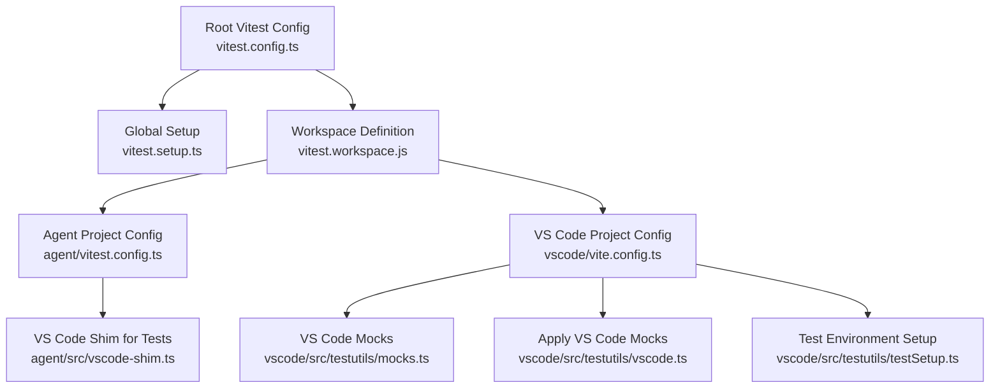
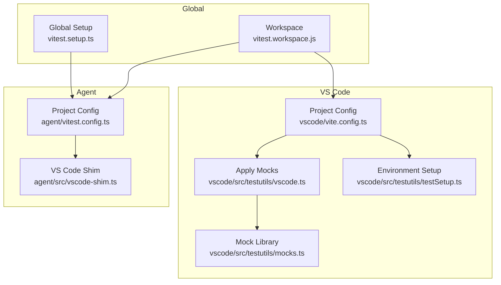
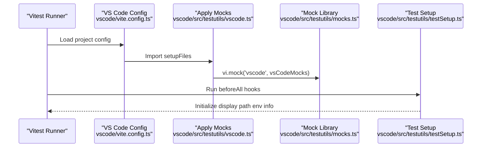
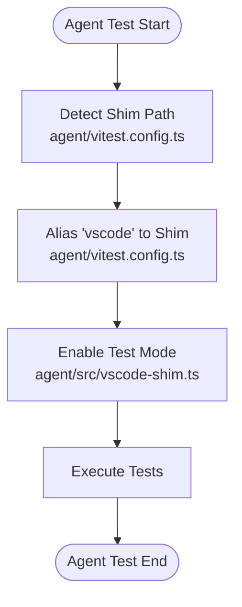
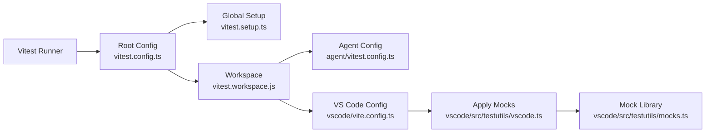

# Unit Testing

<cite>
**Referenced Files in This Document**
- [vitest.config.ts](file://vitest.config.ts)
- [vitest.setup.ts](file://vitest.setup.ts)
- [vitest.workspace.js](file://vitest.workspace.js)
- [.config/viteShared.ts](file://.config/viteShared.ts)
- [agent/vitest.config.ts](file://agent/vitest.config.ts)
- [agent/src/__tests__/example-ts/src/example.test.ts](file://agent/src/__tests__/example-ts/src/example.test.ts)
- [agent/src/vscode-shim.ts](file://agent/src/vscode-shim.ts)
- [vscode/vite.config.ts](file://vscode/vite.config.ts)
- [vscode/src/testutils/vscode.ts](file://vscode/src/testutils/vscode.ts)
- [vscode/src/testutils/testSetup.ts](file://vscode/src/testutils/testSetup.ts)
- [vscode/src/testutils/mocks.ts](file://vscode/src/testutils/mocks.ts)
</cite>

## Table of Contents
1. [Introduction](#introduction)
2. [Project Structure](#project-structure)
3. [Core Components](#core-components)
4. [Architecture Overview](#architecture-overview)
5. [Detailed Component Analysis](#detailed-component-analysis)
6. [Dependency Analysis](#dependency-analysis)
7. [Performance Considerations](#performance-considerations)
8. [Troubleshooting Guide](#troubleshooting-guide)
9. [Conclusion](#conclusion)
10. [Appendices](#appendices)

## Introduction
This document explains how unit testing is set up and executed across the Cody codebase. It covers the Vitest and Jest-based configuration, test environment setup, component testing for React, service testing for backend logic, and utility function testing with robust mocking strategies. It also documents test structure, naming conventions, file placement, and practical patterns for testing VS Code extension APIs, agent runtime components, and shared library functions. Guidance is included for assertion patterns, test isolation, cleanup, and common pitfalls.

## Project Structure
The repository uses a monorepo-like workspace with multiple packages configured under a Vitest workspace. Each package defines its own test configuration and setup files. The top-level Vitest configuration wires a global setup hook to build agent binaries prior to running tests. Shared defaults for projects are centralized in a Vite/Vitest helper.

**Diagram sources**
- [vitest.config.ts:1-8](file://vitest.config.ts#L1-L8)
- [vitest.setup.ts:1-14](file://vitest.setup.ts#L1-L14)
- [vitest.workspace.js:1-4](file://vitest.workspace.js#L1-L4)
- [agent/vitest.config.ts:1-31](file://agent/vitest.config.ts#L1-L31)
- [agent/src/vscode-shim.ts:1-1315](file://agent/src/vscode-shim.ts#L1-L1315)
- [vscode/vite.config.ts:1-16](file://vscode/vite.config.ts#L1-L16)
- [vscode/src/testutils/mocks.ts:1-960](file://vscode/src/testutils/mocks.ts#L1-L960)
- [vscode/src/testutils/vscode.ts:1-9](file://vscode/src/testutils/vscode.ts#L1-L9)
- [vscode/src/testutils/testSetup.ts:1-13](file://vscode/src/testutils/testSetup.ts#L1-L13)

**Section sources**
- [vitest.config.ts:1-8](file://vitest.config.ts#L1-L8)
- [vitest.setup.ts:1-14](file://vitest.setup.ts#L1-L14)
- [vitest.workspace.js:1-4](file://vitest.workspace.js#L1-L4)
- [.config/viteShared.ts:1-51](file://.config/viteShared.ts#L1-L51)
- [agent/vitest.config.ts:1-31](file://agent/vitest.config.ts#L1-L31)
- [vscode/vite.config.ts:1-16](file://vscode/vite.config.ts#L1-L16)

## Core Components
- Vitest workspace and global setup:
  - The root Vitest configuration sets a global setup hook to build agent binaries before tests run. This ensures agent-side tests have compiled artifacts.
  - The workspace definition enumerates all testable packages: agent, cli, lib/shared, lib/prompt-editor, vscode, web.
- Shared project defaults:
  - A helper composes default project settings and merges them per package, including path aliases, CSS modules convention, and fake timers for performance.
- Agent-specific configuration:
  - The agent project resolves the VS Code shim path dynamically and injects a testing environment variable to enable test-specific behavior in the shim.
- VS Code project configuration:
  - Includes React component tests with happy-dom environment, sets up test utilities, and scopes test files to src and webviews.

**Section sources**
- [vitest.config.ts:1-8](file://vitest.config.ts#L1-L8)
- [vitest.setup.ts:1-14](file://vitest.setup.ts#L1-L14)
- [vitest.workspace.js:1-4](file://vitest.workspace.js#L1-L4)
- [.config/viteShared.ts:1-51](file://.config/viteShared.ts#L1-L51)
- [agent/vitest.config.ts:1-31](file://agent/vitest.config.ts#L1-L31)
- [vscode/vite.config.ts:1-16](file://vscode/vite.config.ts#L1-L16)

## Architecture Overview
The testing architecture separates concerns across packages while sharing common infrastructure:
- Global build step prepares agent binaries for agent-side tests.
- Agent runtime tests rely on a VS Code shim that provides a safe subset of VS Code APIs without importing the heavy 'vscode' module.
- VS Code extension tests use a comprehensive mock layer that simulates VS Code APIs and events.
- React component tests run in a DOM-like environment (happy-dom) for webviews and related UI components.

**Diagram sources**
- [vitest.setup.ts:1-14](file://vitest.setup.ts#L1-L14)
- [vitest.workspace.js:1-4](file://vitest.workspace.js#L1-L4)
- [agent/vitest.config.ts:1-31](file://agent/vitest.config.ts#L1-L31)
- [agent/src/vscode-shim.ts:1-1315](file://agent/src/vscode-shim.ts#L1-L1315)
- [vscode/vite.config.ts:1-16](file://vscode/vite.config.ts#L1-L16)
- [vscode/src/testutils/vscode.ts:1-9](file://vscode/src/testutils/vscode.ts#L1-L9)
- [vscode/src/testutils/mocks.ts:1-960](file://vscode/src/testutils/mocks.ts#L1-L960)
- [vscode/src/testutils/testSetup.ts:1-13](file://vscode/src/testutils/testSetup.ts#L1-L13)

## Detailed Component Analysis

### Test Environment Setup and Configuration
- Global setup builds agent binaries before test runs to avoid missing artifacts.
- Workspace aggregates multiple packages and allows per-project overrides.
- Shared defaults configure path aliases, CSS modules, and fake timers for performance.
- Agent project injects a testing flag to activate test-friendly behavior in the shim.
- VS Code project scopes tests to src and webviews, applies happy-dom for React components, and loads setup files.

**Section sources**
- [vitest.config.ts:1-8](file://vitest.config.ts#L1-L8)
- [vitest.setup.ts:1-14](file://vitest.setup.ts#L1-L14)
- [vitest.workspace.js:1-4](file://vitest.workspace.js#L1-L4)
- [.config/viteShared.ts:1-51](file://.config/viteShared.ts#L1-L51)
- [agent/vitest.config.ts:1-31](file://agent/vitest.config.ts#L1-L31)
- [vscode/vite.config.ts:1-16](file://vscode/vite.config.ts#L1-L16)

### VS Code Extension API Mocking
- The VS Code mock library provides classes and enums that mirror VS Code types, enabling deterministic tests without loading the real extension host.
- The mock application script mocks the 'vscode' module globally for all tests in the VS Code project.
- Additional setup initializes environment information (e.g., platform detection and display paths) before tests run.

**Diagram sources**
- [vscode/vite.config.ts:1-16](file://vscode/vite.config.ts#L1-L16)
- [vscode/src/testutils/vscode.ts:1-9](file://vscode/src/testutils/vscode.ts#L1-L9)
- [vscode/src/testutils/mocks.ts:1-960](file://vscode/src/testutils/mocks.ts#L1-L960)
- [vscode/src/testutils/testSetup.ts:1-13](file://vscode/src/testutils/testSetup.ts#L1-L13)

**Section sources**
- [vscode/src/testutils/vscode.ts:1-9](file://vscode/src/testutils/vscode.ts#L1-L9)
- [vscode/src/testutils/mocks.ts:1-960](file://vscode/src/testutils/mocks.ts#L1-L960)
- [vscode/src/testutils/testSetup.ts:1-13](file://vscode/src/testutils/testSetup.ts#L1-L13)

### Agent Runtime Component Testing
- The agent project config dynamically selects the appropriate VS Code shim path depending on the working directory and injects a testing environment variable.
- The shim exposes a safe subset of VS Code APIs and events, enabling agent-side logic to be tested without the full extension host.
- Example tests demonstrate basic usage of Vitest primitives and intentional misuse of timing APIs to validate fake timers behavior.

**Diagram sources**
- [agent/vitest.config.ts:1-31](file://agent/vitest.config.ts#L1-L31)
- [agent/src/vscode-shim.ts:1-1315](file://agent/src/vscode-shim.ts#L1-L1315)

**Section sources**
- [agent/vitest.config.ts:1-31](file://agent/vitest.config.ts#L1-L31)
- [agent/src/vscode-shim.ts:1-1315](file://agent/src/vscode-shim.ts#L1-L1315)
- [agent/src/__tests__/example-ts/src/example.test.ts:1-19](file://agent/src/__tests__/example-ts/src/example.test.ts#L1-L19)

### React Component Testing
- The VS Code project config includes React component tests and sets the environment to happy-dom for DOM-related tests.
- Test files are scoped to src and webviews, ensuring component tests run in a browser-like environment.

**Section sources**
- [vscode/vite.config.ts:1-16](file://vscode/vite.config.ts#L1-L16)

### Utility Function Testing
- Shared defaults enable fake timers for performance, which is essential for tests that manipulate time-sensitive logic.
- The agent project demonstrates intentional misuse of timing APIs to validate fake timers behavior, ensuring tests remain deterministic.

**Section sources**
- [.config/viteShared.ts:1-51](file://.config/viteShared.ts#L1-L51)
- [agent/src/__tests__/example-ts/src/example.test.ts:1-19](file://agent/src/__tests__/example-ts/src/example.test.ts#L1-L19)

### Test Structure Organization, Naming Conventions, and File Placement
- Test files are placed alongside the code they test, using .test.ts or .test.tsx suffixes for unit tests and .tsx for React component tests.
- Examples include:
  - Agent tests under agent/src with __tests__ directories for feature-specific suites.
  - VS Code webviews tests under vscode/webviews/**/* with .test.tsx suffixes.
  - Shared prompt editor tests under lib/prompt-editor/**/* with .test.tsx suffixes.
- Workspace configuration ensures consistent inclusion patterns across packages.

**Section sources**
- [agent/src/__tests__/example-ts/src/example.test.ts:1-19](file://agent/src/__tests__/example-ts/src/example.test.ts#L1-L19)
- [vscode/vite.config.ts:1-16](file://vscode/vite.config.ts#L1-L16)

### Mock Strategies for External Dependencies, Authentication Systems, and Network Requests
- VS Code API mocking:
  - Comprehensive mock library provides classes and enums mirroring VS Code types.
  - Global mock application ensures all tests use the mock 'vscode' module.
- Agent runtime:
  - The shim provides event emitters, cancellation tokens, and workspace/document APIs suitable for agent tests.
- Authentication and network:
  - The agent shim centralizes client info, configuration updates, and notification/request pathways for authentication flows and network interactions.
  - Tests can leverage the shim’s event emitters and configuration hooks to simulate authentication callbacks and server interactions.

**Section sources**
- [vscode/src/testutils/mocks.ts:1-960](file://vscode/src/testutils/mocks.ts#L1-L960)
- [vscode/src/testutils/vscode.ts:1-9](file://vscode/src/testutils/vscode.ts#L1-L9)
- [agent/src/vscode-shim.ts:1-1315](file://agent/src/vscode-shim.ts#L1-L1315)

### Guidelines for Writing Effective Unit Tests
- Assertion patterns:
  - Use Vitest’s expect-style assertions for clarity and rich failure messages.
  - Prefer focused assertions that validate a single behavior per test.
- Test isolation:
  - Keep tests independent; avoid relying on shared mutable state.
  - Use beforeEach/beforeAll sparingly and limit shared setup to minimal, necessary initialization.
- Cleanup procedures:
  - Dispose of event emitters and cancellation tokens after tests.
  - Clear mocks and reset global state between tests when applicable.
- Deterministic timing:
  - Leverage fake timers to control time-sensitive logic.
  - Validate performance-related behavior with controlled time progression.

**Section sources**
- [.config/viteShared.ts:1-51](file://.config/viteShared.ts#L1-L51)
- [agent/src/__tests__/example-ts/src/example.test.ts:1-19](file://agent/src/__tests__/example-ts/src/example.test.ts#L1-L19)

## Dependency Analysis
The testing stack depends on:
- Vitest for test runner and assertion library.
- Happy DOM for DOM simulation in React component tests.
- Global setup to build agent binaries prior to test execution.
- Per-project configurations that inherit shared defaults and override as needed.

**Diagram sources**
- [vitest.config.ts:1-8](file://vitest.config.ts#L1-L8)
- [vitest.setup.ts:1-14](file://vitest.setup.ts#L1-L14)
- [vitest.workspace.js:1-4](file://vitest.workspace.js#L1-L4)
- [agent/vitest.config.ts:1-31](file://agent/vitest.config.ts#L1-L31)
- [vscode/vite.config.ts:1-16](file://vscode/vite.config.ts#L1-L16)
- [vscode/src/testutils/vscode.ts:1-9](file://vscode/src/testutils/vscode.ts#L1-L9)
- [vscode/src/testutils/mocks.ts:1-960](file://vscode/src/testutils/mocks.ts#L1-L960)

**Section sources**
- [vitest.config.ts:1-8](file://vitest.config.ts#L1-L8)
- [vitest.setup.ts:1-14](file://vitest.setup.ts#L1-L14)
- [vitest.workspace.js:1-4](file://vitest.workspace.js#L1-L4)
- [agent/vitest.config.ts:1-31](file://agent/vitest.config.ts#L1-L31)
- [vscode/vite.config.ts:1-16](file://vscode/vite.config.ts#L1-L16)

## Performance Considerations
- Fake timers for performance:
  - Shared defaults fake performance timer along with others to improve determinism and speed for time-dependent logic.
- Minimal DOM overhead:
  - Happy DOM is used selectively for React component tests to reduce overhead compared to heavier environments.

**Section sources**
- [.config/viteShared.ts:1-51](file://.config/viteShared.ts#L1-L51)
- [vscode/vite.config.ts:1-16](file://vscode/vite.config.ts#L1-L16)

## Troubleshooting Guide
- Missing agent binaries:
  - Ensure the global setup step runs to build agent binaries before tests execute.
- VS Code API not found:
  - Confirm that the mock application script is loaded via setupFiles and that the mock library is imported correctly.
- Timing-related failures:
  - Verify that fake timers are active and that time-sensitive logic is properly controlled.
- Shim path resolution:
  - Confirm that the agent project config detects the correct shim path and that the testing environment variable is set.

**Section sources**
- [vitest.setup.ts:1-14](file://vitest.setup.ts#L1-L14)
- [vscode/src/testutils/vscode.ts:1-9](file://vscode/src/testutils/vscode.ts#L1-L9)
- [.config/viteShared.ts:1-51](file://.config/viteShared.ts#L1-L51)
- [agent/vitest.config.ts:1-31](file://agent/vitest.config.ts#L1-L31)

## Conclusion
Cody’s unit testing setup leverages a shared, configurable foundation with targeted mocks for VS Code APIs and agent runtime components. The configuration ensures deterministic tests, efficient execution, and clear separation of concerns across packages. By following the established patterns for structure, naming, and mocking, contributors can write reliable unit tests that validate both frontend components and backend logic effectively.

## Appendices
- Example test file demonstrating Vitest primitives and fake timers behavior:
  - [agent/src/__tests__/example-ts/src/example.test.ts:1-19](file://agent/src/__tests__/example-ts/src/example.test.ts#L1-L19)