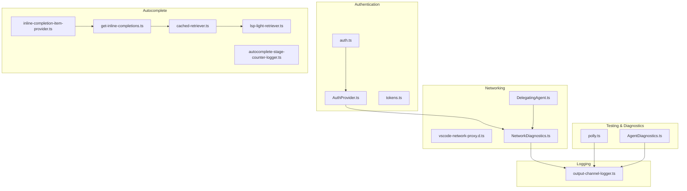
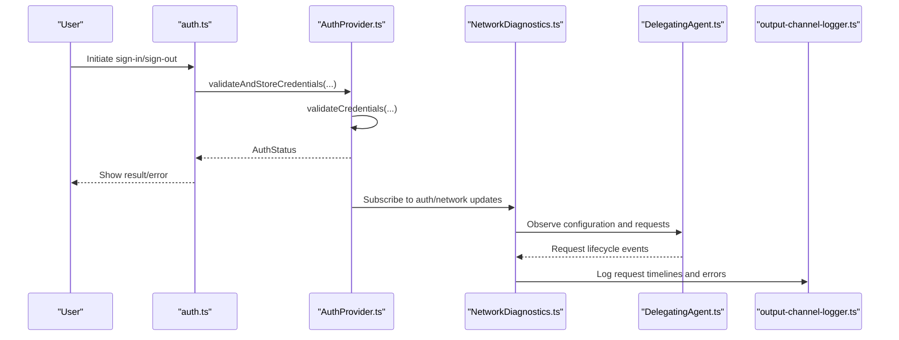
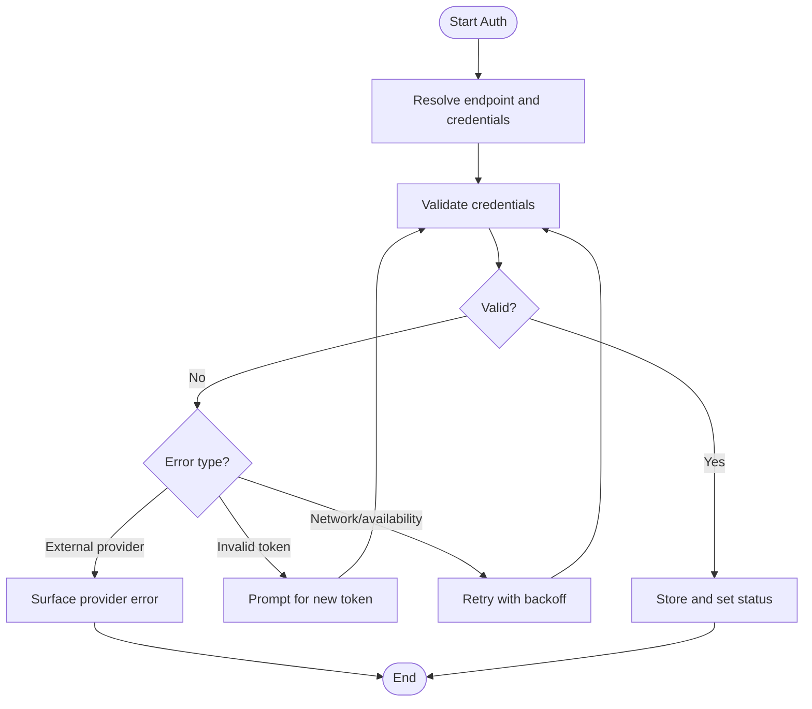
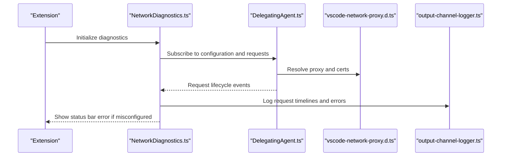
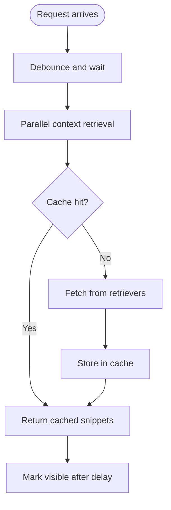
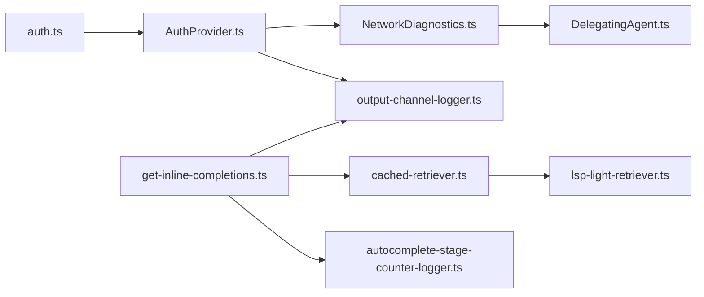

# Troubleshooting & Support

<cite>
**Referenced Files in This Document**
- [auth.ts](file://vscode/src/auth/auth.ts)
- [AuthProvider.ts](file://vscode/src/services/AuthProvider.ts)
- [NetworkDiagnostics.ts](file://vscode/src/services/NetworkDiagnostics.ts)
- [output-channel-logger.ts](file://vscode/src/output-channel-logger.ts)
- [DelegatingAgent.ts](file://vscode/src/net/DelegatingAgent.ts)
- [vscode-network-proxy.d.ts](file://vscode/src/net/vscode-network-proxy.d.ts)
- [tokens.ts](file://lib/shared/src/auth/tokens.ts)
- [polly.ts](file://vscode/src/testutils/polly.ts)
- [AgentDiagnostics.ts](file://agent/src/AgentDiagnostics.ts)
- [inline-completion-item-provider.ts](file://vscode/src/completions/inline-completion-item-provider.ts)
- [get-inline-completions.ts](file://vscode/src/completions/get-inline-completions.ts)
- [cached-retriever.ts](file://vscode/src/completions/context/retrievers/cached-retriever.ts)
- [lsp-light-retriever.ts](file://vscode/src/completions/context/retrievers/lsp-light/lsp-light-retriever.ts)
- [autocomplete-stage-counter-logger.ts](file://vscode/src/services/autocomplete-stage-counter-logger.ts)
- [feedback.md](file://.github/ISSUE_TEMPLATE/feedback.md)
</cite>

## Table of Contents
1. [Introduction](#introduction)
2. [Project Structure](#project-structure)
3. [Core Components](#core-components)
4. [Architecture Overview](#architecture-overview)
5. [Detailed Component Analysis](#detailed-component-analysis)
6. [Dependency Analysis](#dependency-analysis)
7. [Performance Considerations](#performance-considerations)
8. [Troubleshooting Guide](#troubleshooting-guide)
9. [Conclusion](#conclusion)
10. [Appendices](#appendices)

## Introduction
This document provides a comprehensive troubleshooting and support guide for Cody users and developers. It covers installation issues, authentication failures, performance problems, debugging techniques, diagnostic tools, and support channels. It includes practical, step-by-step guidance and diagrams to help diagnose and resolve common issues efficiently.

## Project Structure
Cody’s troubleshooting surface spans several subsystems:
- Authentication and credential validation
- Network diagnostics and proxy configuration
- Logging and output channels
- Autocomplete performance and context retrieval
- Recording and replay utilities for debugging
- Agent-side diagnostics

**Diagram sources**
- [auth.ts:1-200](file://vscode/src/auth/auth.ts#L1-L200)
- [AuthProvider.ts:1-380](file://vscode/src/services/AuthProvider.ts#L1-L380)
- [tokens.ts:1-25](file://lib/shared/src/auth/tokens.ts#L1-L25)
- [DelegatingAgent.ts:166-523](file://vscode/src/net/DelegatingAgent.ts#L166-L523)
- [vscode-network-proxy.d.ts:15-66](file://vscode/src/net/vscode-network-proxy.d.ts#L15-L66)
- [NetworkDiagnostics.ts:1-382](file://vscode/src/services/NetworkDiagnostics.ts#L1-L382)
- [output-channel-logger.ts:1-165](file://vscode/src/output-channel-logger.ts#L1-L165)
- [inline-completion-item-provider.ts:720-747](file://vscode/src/completions/inline-completion-item-provider.ts#L720-L747)
- [get-inline-completions.ts:426-464](file://vscode/src/completions/get-inline-completions.ts#L426-L464)
- [cached-retriever.ts:68-93](file://vscode/src/completions/context/retrievers/cached-retriever.ts#L68-L93)
- [lsp-light-retriever.ts:37-67](file://vscode/src/completions/context/retrievers/lsp-light/lsp-light-retriever.ts#L37-L67)
- [autocomplete-stage-counter-logger.ts:1-46](file://vscode/src/services/autocomplete-stage-counter-logger.ts#L1-L46)
- [polly.ts:1-120](file://vscode/src/testutils/polly.ts#L1-L120)
- [AgentDiagnostics.ts:1-15](file://agent/src/AgentDiagnostics.ts#L1-L15)

**Section sources**
- [auth.ts:1-200](file://vscode/src/auth/auth.ts#L1-L200)
- [AuthProvider.ts:1-380](file://vscode/src/services/AuthProvider.ts#L1-L380)
- [NetworkDiagnostics.ts:1-382](file://vscode/src/services/NetworkDiagnostics.ts#L1-L382)
- [output-channel-logger.ts:1-165](file://vscode/src/output-channel-logger.ts#L1-L165)
- [DelegatingAgent.ts:166-523](file://vscode/src/net/DelegatingAgent.ts#L166-L523)
- [vscode-network-proxy.d.ts:15-66](file://vscode/src/net/vscode-network-proxy.d.ts#L15-L66)
- [tokens.ts:1-25](file://lib/shared/src/auth/tokens.ts#L1-L25)
- [polly.ts:1-120](file://vscode/src/testutils/polly.ts#L1-L120)
- [AgentDiagnostics.ts:1-15](file://agent/src/AgentDiagnostics.ts#L1-L15)
- [inline-completion-item-provider.ts:720-747](file://vscode/src/completions/inline-completion-item-provider.ts#L720-L747)
- [get-inline-completions.ts:426-464](file://vscode/src/completions/get-inline-completions.ts#L426-L464)
- [cached-retriever.ts:68-93](file://vscode/src/completions/context/retrievers/cached-retriever.ts#L68-L93)
- [lsp-light-retriever.ts:37-67](file://vscode/src/completions/context/retrievers/lsp-light/lsp-light-retriever.ts#L37-L67)
- [autocomplete-stage-counter-logger.ts:1-46](file://vscode/src/services/autocomplete-stage-counter-logger.ts#L1-L46)

## Core Components
- Authentication and token handling: Validates tokens, handles enterprise/dotcom flows, and surfaces errors.
- Network diagnostics: Captures request timelines, logs errors, and integrates with the status bar.
- Logging: Centralized output channels with filtering and optional file logging.
- Autocomplete pipeline: Debounce, caching, context retrieval, and stage timing.
- Testing and replay: Polly-based request recording and replay for deterministic debugging.

**Section sources**
- [auth.ts:46-288](file://vscode/src/auth/auth.ts#L46-L288)
- [AuthProvider.ts:45-335](file://vscode/src/services/AuthProvider.ts#L45-L335)
- [NetworkDiagnostics.ts:33-304](file://vscode/src/services/NetworkDiagnostics.ts#L33-L304)
- [output-channel-logger.ts:47-106](file://vscode/src/output-channel-logger.ts#L47-L106)
- [get-inline-completions.ts:426-464](file://vscode/src/completions/get-inline-completions.ts#L426-L464)
- [polly.ts:20-120](file://vscode/src/testutils/polly.ts#L20-L120)

## Architecture Overview
The troubleshooting architecture connects authentication, networking, logging, and autocomplete systems to provide actionable diagnostics.

**Diagram sources**
- [auth.ts:61-146](file://vscode/src/auth/auth.ts#L61-L146)
- [AuthProvider.ts:248-280](file://vscode/src/services/AuthProvider.ts#L248-L280)
- [NetworkDiagnostics.ts:219-249](file://vscode/src/services/NetworkDiagnostics.ts#L219-L249)
- [DelegatingAgent.ts:166-296](file://vscode/src/net/DelegatingAgent.ts#L166-L296)
- [output-channel-logger.ts:47-106](file://vscode/src/output-channel-logger.ts#L47-L106)

## Detailed Component Analysis

### Authentication Troubleshooting
Common issues:
- Invalid access token
- Endpoint availability/network errors
- External provider auth errors
- Enterprise vs dotcom mismatch

Resolution steps:
- Re-enter token or use browser-based login flow.
- Verify instance URL and network reachability.
- Check enterprise policy and user role.
- Use the “refresh” command to re-validate credentials.

**Diagram sources**
- [auth.ts:496-557](file://vscode/src/auth/auth.ts#L496-L557)
- [auth.ts:526-557](file://vscode/src/auth/auth.ts#L526-L557)
- [AuthProvider.ts:61-88](file://vscode/src/services/AuthProvider.ts#L61-L88)
- [AuthProvider.ts:148-170](file://vscode/src/services/AuthProvider.ts#L148-L170)

**Section sources**
- [auth.ts:496-557](file://vscode/src/auth/auth.ts#L496-L557)
- [auth.ts:526-557](file://vscode/src/auth/auth.ts#L526-L557)
- [AuthProvider.ts:61-88](file://vscode/src/services/AuthProvider.ts#L61-L88)
- [AuthProvider.ts:148-170](file://vscode/src/services/AuthProvider.ts#L148-L170)

### Network Diagnostics and Proxy Issues
Symptoms:
- Requests fail or hang
- Certificate or proxy misconfiguration
- Unexpected timeouts

Tools:
- Network diagnostics output channel
- Status bar error indicator
- Proxy resolution telemetry and logging

Actions:
- Inspect “Cody: Network” output channel.
- Use “cody.debug.net.showOutputChannel” to reveal logs.
- Review proxy settings and CA certificates.

**Diagram sources**
- [NetworkDiagnostics.ts:33-304](file://vscode/src/services/NetworkDiagnostics.ts#L33-L304)
- [DelegatingAgent.ts:166-523](file://vscode/src/net/DelegatingAgent.ts#L166-L523)
- [vscode-network-proxy.d.ts:15-66](file://vscode/src/net/vscode-network-proxy.d.ts#L15-L66)
- [output-channel-logger.ts:125-164](file://vscode/src/output-channel-logger.ts#L125-L164)

**Section sources**
- [NetworkDiagnostics.ts:180-217](file://vscode/src/services/NetworkDiagnostics.ts#L180-L217)
- [NetworkDiagnostics.ts:251-294](file://vscode/src/services/NetworkDiagnostics.ts#L251-L294)
- [DelegatingAgent.ts:166-523](file://vscode/src/net/DelegatingAgent.ts#L166-L523)
- [vscode-network-proxy.d.ts:15-66](file://vscode/src/net/vscode-network-proxy.d.ts#L15-L66)

### Logging and Output Channels
- Centralized logger supports filtering and verbose output.
- Optional file logging via environment variable.
- Feature-specific channels in development.

Actions:
- Enable debug filters and verbose mode.
- Save logs to a file for sharing with support.
- Use feature-specific channels for targeted debugging.

**Section sources**
- [output-channel-logger.ts:12-45](file://vscode/src/output-channel-logger.ts#L12-L45)
- [output-channel-logger.ts:47-106](file://vscode/src/output-channel-logger.ts#L47-L106)
- [output-channel-logger.ts:125-164](file://vscode/src/output-channel-logger.ts#L125-L164)

### Autocomplete Performance and Context Retrieval
Common symptoms:
- Slow suggestions
- High latency in context retrieval
- Frequent cancellations or throttling

Mechanisms:
- Debounce and smart throttle
- Parallel context retrieval
- Caching and abort on new requests
- Stage timing counters

**Diagram sources**
- [get-inline-completions.ts:426-464](file://vscode/src/completions/get-inline-completions.ts#L426-L464)
- [cached-retriever.ts:68-93](file://vscode/src/completions/context/retrievers/cached-retriever.ts#L68-L93)
- [lsp-light-retriever.ts:37-67](file://vscode/src/completions/context/retrievers/lsp-light/lsp-light-retriever.ts#L37-L67)
- [inline-completion-item-provider.ts:720-747](file://vscode/src/completions/inline-completion-item-provider.ts#L720-L747)

**Section sources**
- [get-inline-completions.ts:426-464](file://vscode/src/completions/get-inline-completions.ts#L426-L464)
- [cached-retriever.ts:68-93](file://vscode/src/completions/context/retrievers/cached-retriever.ts#L68-L93)
- [lsp-light-retriever.ts:37-67](file://vscode/src/completions/context/retrievers/lsp-light/lsp-light-retriever.ts#L37-L67)
- [inline-completion-item-provider.ts:720-747](file://vscode/src/completions/inline-completion-item-provider.ts#L720-L747)

### Testing and Replay Utilities
- Polly-based request recording and replay.
- Stable canonicalization of JSON bodies.
- Authorization header redaction for deterministic replays.

Use cases:
- Reproduce intermittent network issues.
- Share reproducible test artifacts with the team.

**Section sources**
- [polly.ts:20-120](file://vscode/src/testutils/polly.ts#L20-L120)

### Agent Diagnostics
- Agent-side diagnostics publisher for per-uri diagnostics.
- Useful for agent integration tests and debugging.

**Section sources**
- [AgentDiagnostics.ts:4-14](file://agent/src/AgentDiagnostics.ts#L4-L14)

## Dependency Analysis
Authentication depends on:
- Credential validation and storage
- Network configuration and diagnostics
- Telemetry and logging

Autocomplete depends on:
- Context retrievers and caching
- Smart throttle and debounce
- Stage timing and counters

**Diagram sources**
- [auth.ts:61-146](file://vscode/src/auth/auth.ts#L61-L146)
- [AuthProvider.ts:248-280](file://vscode/src/services/AuthProvider.ts#L248-L280)
- [NetworkDiagnostics.ts:33-304](file://vscode/src/services/NetworkDiagnostics.ts#L33-L304)
- [DelegatingAgent.ts:166-296](file://vscode/src/net/DelegatingAgent.ts#L166-L296)
- [output-channel-logger.ts:47-106](file://vscode/src/output-channel-logger.ts#L47-L106)
- [get-inline-completions.ts:426-464](file://vscode/src/completions/get-inline-completions.ts#L426-L464)
- [cached-retriever.ts:68-93](file://vscode/src/completions/context/retrievers/cached-retriever.ts#L68-L93)
- [lsp-light-retriever.ts:37-67](file://vscode/src/completions/context/retrievers/lsp-light/lsp-light-retriever.ts#L37-L67)
- [autocomplete-stage-counter-logger.ts:1-46](file://vscode/src/services/autocomplete-stage-counter-logger.ts#L1-L46)

**Section sources**
- [auth.ts:61-146](file://vscode/src/auth/auth.ts#L61-L146)
- [AuthProvider.ts:248-280](file://vscode/src/services/AuthProvider.ts#L248-L280)
- [NetworkDiagnostics.ts:33-304](file://vscode/src/services/NetworkDiagnostics.ts#L33-L304)
- [DelegatingAgent.ts:166-296](file://vscode/src/net/DelegatingAgent.ts#L166-L296)
- [output-channel-logger.ts:47-106](file://vscode/src/output-channel-logger.ts#L47-L106)
- [get-inline-completions.ts:426-464](file://vscode/src/completions/get-inline-completions.ts#L426-L464)
- [cached-retriever.ts:68-93](file://vscode/src/completions/context/retrievers/cached-retriever.ts#L68-L93)
- [lsp-light-retriever.ts:37-67](file://vscode/src/completions/context/retrievers/lsp-light/lsp-light-retriever.ts#L37-L67)
- [autocomplete-stage-counter-logger.ts:1-46](file://vscode/src/services/autocomplete-stage-counter-logger.ts#L1-L46)

## Performance Considerations
- Debounce and remaining intervals reduce redundant work.
- Parallel context retrieval improves responsiveness.
- Smart throttle cancels stale requests and prioritizes start-of-line edits.
- Stage counters help identify bottlenecks in the autocomplete pipeline.

Recommendations:
- Monitor stage counters and request timelines.
- Reduce context size hints if latency increases.
- Ensure proxy and certificate configuration is correct to avoid retries.

[No sources needed since this section provides general guidance]

## Troubleshooting Guide

### Installation Problems
- Platform-specific issues: Verify OS and architecture compatibility and follow the platform-specific setup steps.
- Dependency conflicts: Reinstall dependencies and ensure compatible versions of Node.js and package managers.
- Permission errors: Run as administrator or adjust filesystem permissions for the installation directory.

Diagnostic steps:
- Check logs in the default “Cody by Sourcegraph” output channel.
- Enable verbose logging and reproduce the issue.

**Section sources**
- [output-channel-logger.ts:12-45](file://vscode/src/output-channel-logger.ts#L12-L45)

### Authentication Failures
- Invalid access token:
  - Re-enter token or use browser-based login.
  - Confirm token validity and scopes.
- SSO problems:
  - Check identity provider health and redirect URLs.
  - Clear cached cookies and retry login.
- Enterprise integration:
  - Verify instance URL and admin policies.
  - Confirm user role and license status.

Actions:
- Use the sign-in menu and “refresh” command to re-validate.
- Inspect authentication status and error messages.

**Section sources**
- [auth.ts:101-146](file://vscode/src/auth/auth.ts#L101-L146)
- [auth.ts:496-557](file://vscode/src/auth/auth.ts#L496-L557)
- [AuthProvider.ts:148-170](file://vscode/src/services/AuthProvider.ts#L148-L170)

### Performance Issues
- Slow autocomplete:
  - Reduce context size hints.
  - Disable or tune aggressive context retrievers.
  - Check stage counters for pipeline bottlenecks.
- Memory usage:
  - Monitor context caching and retriever behavior.
  - Restart the editor to clear caches.
- Context retrieval delays:
  - Verify network configuration and proxy settings.
  - Inspect request timelines in the network diagnostics channel.

**Section sources**
- [get-inline-completions.ts:426-464](file://vscode/src/completions/get-inline-completions.ts#L426-L464)
- [cached-retriever.ts:68-93](file://vscode/src/completions/context/retrievers/cached-retriever.ts#L68-L93)
- [autocomplete-stage-counter-logger.ts:23-46](file://vscode/src/services/autocomplete-stage-counter-logger.ts#L23-L46)
- [NetworkDiagnostics.ts:180-217](file://vscode/src/services/NetworkDiagnostics.ts#L180-L217)

### Debugging Techniques
- Log analysis:
  - Use the “Cody: Network” output channel for request timelines.
  - Enable debug filters and verbose mode for detailed logs.
- Performance profiling:
  - Review stage timings and counters.
  - Use Polly to record and replay requests for analysis.
- Network troubleshooting:
  - Validate proxy settings and CA certificates.
  - Inspect proxy resolution telemetry.

**Section sources**
- [NetworkDiagnostics.ts:200-217](file://vscode/src/services/NetworkDiagnostics.ts#L200-L217)
- [output-channel-logger.ts:125-164](file://vscode/src/output-channel-logger.ts#L125-L164)
- [polly.ts:20-120](file://vscode/src/testutils/polly.ts#L20-L120)

### Diagnostic Tools and Utilities
- Network diagnostics output channel
- Status bar error notifications
- Polly request recording and replay
- Stage counters for autocomplete pipeline
- Agent diagnostics publisher

**Section sources**
- [NetworkDiagnostics.ts:33-304](file://vscode/src/services/NetworkDiagnostics.ts#L33-L304)
- [polly.ts:20-120](file://vscode/src/testutils/polly.ts#L20-L120)
- [autocomplete-stage-counter-logger.ts:23-46](file://vscode/src/services/autocomplete-stage-counter-logger.ts#L23-L46)
- [AgentDiagnostics.ts:4-14](file://agent/src/AgentDiagnostics.ts#L4-L14)

### Support Channels
- Community forum for feedback and feature requests
- GitHub issues for bug reports (ensure you use the correct channel)

Note: Feedback and feature requests are directed to the community forum; GitHub issues are reserved for bugs.

**Section sources**
- [feedback.md:1-13](file://.github/ISSUE_TEMPLATE/feedback.md#L1-L13)

### Systematic Diagnosis and Resolution
- Isolate the subsystem (authentication, networking, autocomplete).
- Collect logs and request timelines.
- Reproduce with Polly recordings when applicable.
- Apply targeted fixes (token refresh, proxy/cert adjustments, pipeline tuning).
- Validate with status bar indicators and counters.

[No sources needed since this section summarizes general procedures]

## Conclusion
This guide consolidates Cody’s built-in diagnostics and tools to help you troubleshoot installation, authentication, performance, and networking issues. Use the output channels, network diagnostics, and autocomplete stage counters to pinpoint problems, and leverage Polly for reproducible debugging. For support, use the community forum for feedback and GitHub issues for confirmed bugs.

[No sources needed since this section summarizes without analyzing specific files]

## Appendices

### Common Error Messages and Solutions
- Authentication failures:
  - Invalid access token: Re-enter token or use browser login.
  - Network/availability errors: Retry after verifying connectivity.
  - External provider errors: Follow provider-specific guidance.
- Network/proxy issues:
  - Proxy misconfiguration: Adjust proxy settings and CA certificates.
  - Certificate errors: Load system certificates or provide custom CA bundle.
- Autocomplete slowness:
  - High latency: Reduce context size hints and disable heavy retrievers.
  - Frequent cancellations: Tune debounce and smart throttle settings.

**Section sources**
- [auth.ts:496-557](file://vscode/src/auth/auth.ts#L496-L557)
- [AuthProvider.ts:148-170](file://vscode/src/services/AuthProvider.ts#L148-L170)
- [DelegatingAgent.ts:166-523](file://vscode/src/net/DelegatingAgent.ts#L166-L523)
- [get-inline-completions.ts:426-464](file://vscode/src/completions/get-inline-completions.ts#L426-L464)

### Enterprise-Specific Scenarios and Escalation
- Enterprise user on dotcom:
  - Detected when client config indicates enterprise usage; switch to enterprise endpoint.
- Endpoint mismatch:
  - Ensure token matches the intended instance; re-authenticate if needed.
- Escalation:
  - Collect logs, request timelines, and Polly recordings.
  - Provide environment details and reproduction steps.

**Section sources**
- [auth.ts:540-557](file://vscode/src/auth/auth.ts#L540-L557)
- [tokens.ts:1-25](file://lib/shared/src/auth/tokens.ts#L1-L25)